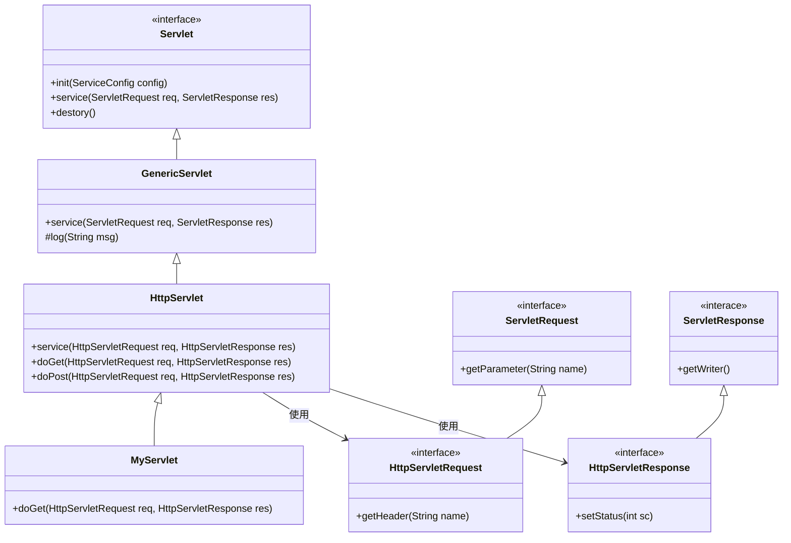
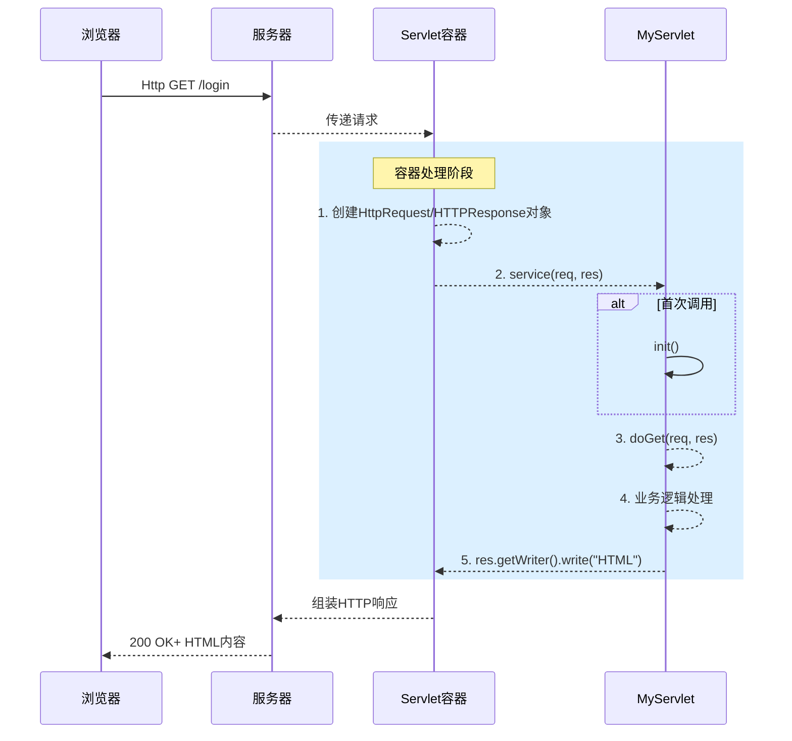
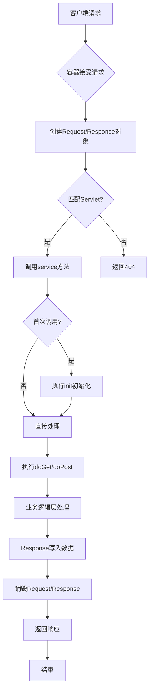

# Servlet技术详解

以下是针对 **Servlet技术**的UML图详解（类图 + 时序图 + 活动图）及核心原理介绍。

## 一、Servlet核心类图（Class Diagram）

:pushpin:**类图解析**：

1. **核心接口**
   - **Servlet**：定义生命周期方法（init、Service、destory）
   - **ServletRequest** | **ServletResponse**：封装请求/响应基础操作
2. **抽象实现层**：
   - **GenericServlet**：协议无关的实现（可用于FTP/SMTP）
   - **HttpServlet**：专为HTTP协议设计（实现doGet、doPost等）
3. **开发者自定义**：
   - **MyServlet**：继承`HttpServlet`并重写业务方法		
4. **HTTP扩展接口**：
   - **HttpServletRequest**：添加HTTP专属方法（getHeader、getSession）
   - **HttpServletResponse**：支持HTTP状态码、Cookie等

> [!NOTE]
>
> :bulb:**设计思想**：通过分层抽象（接口 -> 通用类 -> 协议类 -> 业务类 ）实现高扩展性。

---

## 二、Servlet请求时序图（Sequence Diagram）

:pushpin:**时序图解析**：

1. **请求传递**

   浏览器 -> Web服务器（如Nginx） -> Servlet容器（Tomcat）

2. **容器预处理**

   - 创建线程安全的`HttpServletRequest` | `HttpServletResponse`对象
   - 匹配`URL`到对应的`Servlet`

3. **Servlet生命周期**

   - 首次调用时执行 `init()`（通常加载配置）
   - 调用 `Service()` -> 路由到 `doGet()` 或 `doGet()`

4. **业务处理**

   - 通过 `req` 获取参数
   - 通过 `res` 输出响应（`Writer.write()`）

5. **响应返回**

   容器将响应数据封装为 `HTTP报文`返回客户端

> [!WARNING] 
>
> **关键特性**：
>
> - 每个请求在 **独立线程**中处理（Servlet实例线程安全由容器保证）
> - `Request` | `Response`对象生命周期 = 单次请求

---

## 三、Servlet容器活动图（Activity Diagram）

:pushpin:**活动图解析**：

1. **请求路由阶段**
   - 容器解析 URL 路径 -> 匹配 `web.xml`或 注解配置的Servlet
2. **初始化检查**
   - 首次调用时加载 `init()`（常用来初始化数据库连接）
3. **请求处理核心**
   - 根据 HTTP 方法分发到 `doGet()`(GET -> `doGet`, POST -> `doPost`)
   - 开发者在此实现业务逻辑（如验证登录）
4. **资源清理**
   - 请求结束时销毁 `Request/Response`对象（非Servlet本身）
   - `Servlet`实例通常驻留内存直至容器关闭

---

## 四、Servler技术核心总结

| 维度         | 说明                                                         |
| :----------- | :----------------------------------------------------------- |
| **核心接口** | `Servlet`(生命周期)、`ServletRequest/Response`（数据传输）   |
| **运行容器** | Tomcat/Jetty等负责：线程管理、对象创建、URL映射、生命周期调度 |
| **线程模型** | 单例多线程（每个请求对立线程，**谨慎处理实例变量共享问题**   |
| **配置方式** | 传统 `web.xml` 或 现代注解（`@WebServlet("/login")`）        |
| **优化实践** | 使用 `Filter`处理通用逻辑（如编码设置）、`Listener`监听上下文事件 |
| **典型流程** | 请求 -> 容器创建 req/res -> 调用 `service()` -> 业务处理 -> 输出响应 -> 销毁临时对象 |

>:fire: **进阶理解**：
>
>`Servlet`本质是 **java对CGI的进化**，通过**常驻内存 + 线程池**解决CGI的进程创建开销问题，成为Java Web技术的基石。