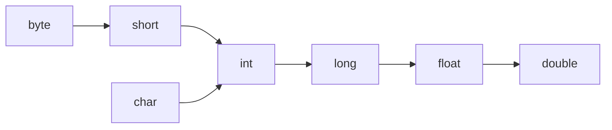
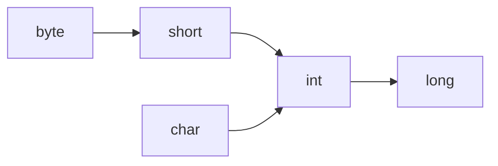
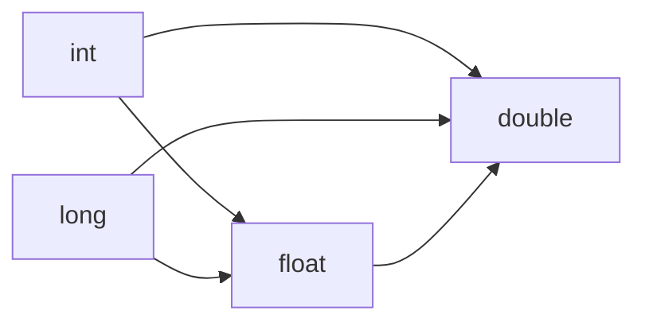
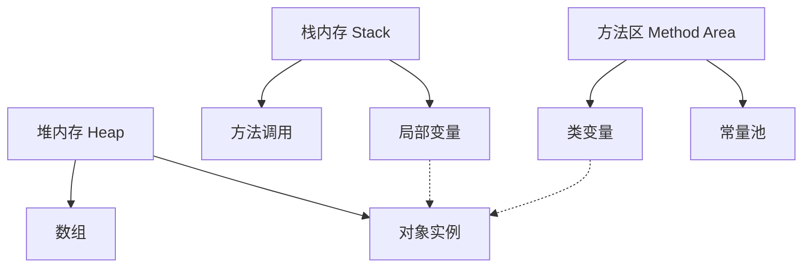

# III. 基本程序设计结构

详细介绍Java的基本程序设计结构，包括==变量==、==运算符==、==控制流==等基础内容。由于之前已经讨论过数据类型，这里会适当关联但不再重复详细的数据类型介绍。

## Java 基本程序设计结构详解

#### 一、[变量与常量](#variable)
```java
// 变量声明与初始化
int age = 25;                 // 基本类型变量
String name = "Alice";        // 引用类型变量
final double PI = 3.14159;    // 常量（final关键字）

// 多个变量声明
int x = 5, y = 10, z = 15;
```

#### 二、[运算符](#operator)
```java
// 1. 算术运算符
int sum = 10 + 5;     // 15
int diff = 10 - 5;    // 5
int product = 10 * 5; // 50
int quotient = 10 / 5; // 2
int remainder = 10 % 3; // 1

// 2. 关系运算符
boolean isEqual = (10 == 10);   // true
boolean notEqual = (10 != 5);   // true
boolean greater = (10 > 5);     // true

// 3. 逻辑运算符
boolean andResult = (true && false); // false
boolean orResult = (true || false);  // true
boolean notResult = !true;           // false

// 4. 赋值运算符
int count = 10;
count += 5;  // 等价于 count = count + 5 → 15
count *= 2;  // 30
```

#### 三、[控制结构](#control)
```java
// 1. 条件语句
int score = 85;

// if-else
if (score >= 90) {
    System.out.println("优秀");
} else if (score >= 80) {
    System.out.println("良好"); // 输出此项
} else {
    System.out.println("需努力");
}

// switch-case
char grade = 'B';
switch (grade) {
    case 'A':
        System.out.println("优秀");
        break;
    case 'B':
        System.out.println("良好"); // 输出此项
        break;
    default:
        System.out.println("无效等级");
}

// 2. 循环结构
// for循环
for (int i = 0; i < 5; i++) {
    System.out.print(i + " "); // 输出: 0 1 2 3 4 
}

// 增强for循环
int[] numbers = {1, 2, 3, 4, 5};
for (int num : numbers) {
    System.out.print(num + " "); // 输出: 1 2 3 4 5
}

// while循环
int count = 0;
while (count < 3) {
    System.out.println("计数: " + count);
    count++;
}

// do-while循环
int i = 5;
do {
    System.out.println("至少执行一次");
} while (i < 3);
```

#### 四、[输入输出](#scanner)
```java
import java.util.Scanner;

public class InputOutput {
    public static void main(String[] args) {
        // 创建Scanner对象
        Scanner scanner = new Scanner(System.in);
        
        // 输入不同类型数据
        System.out.print("请输入姓名: ");
        String name = scanner.nextLine();
        
        System.out.print("请输入年龄: ");
        int age = scanner.nextInt();
        
        System.out.print("请输入身高(m): ");
        double height = scanner.nextDouble();
        
        // 格式化输出
        System.out.printf("姓名: %s, 年龄: %d, 身高: %.2f米%n", name, age, height);
        
        // 关闭Scanner
        scanner.close();
    }
}
```

#### 五、[字符串处理](#string)
```java
String message = "  Hello, Java!  ";

// 基本操作
int length = message.length();       // 16
String upper = message.toUpperCase(); // "  HELLO, JAVA!  "
String trimmed = message.trim();     // "Hello, Java!"

// 字符串连接
String firstName = "John";
String lastName = "Doe";
String fullName = firstName + " " + lastName; // "John Doe"

// 字符串比较
boolean isEqual = "Java".equals("java"); // false
boolean ignoreCase = "Java".equalsIgnoreCase("java"); // true

// 子字符串
String sub = message.substring(2, 7); // "Hello"

// 字符串拆分
String data = "apple,orange,banana";
String[] fruits = data.split(","); // ["apple", "orange", "banana"]
```

#### 六、[数组操作](#array)
```java
// 数组声明与初始化
int[] numbers = new int[3];       // {0, 0, 0}
int[] primes = {2, 3, 5, 7, 11}; // 直接初始化

// 二维数组
int[][] matrix = {
    {1, 2, 3},
    {4, 5, 6}
};

// 数组遍历
for (int i = 0; i < primes.length; i++) {
    System.out.println(primes[i]);
}

// 数组排序
import java.util.Arrays;
Arrays.sort(primes); // 升序排序

// 数组复制
int[] copy = Arrays.copyOf(primes, primes.length);
```

#### 七、方法定义与调用
```java
public class MethodDemo {
    // 无返回值方法
    public static void greet() {
        System.out.println("Hello!");
    }
    
    // 带参数有返回值方法
    public static int add(int a, int b) {
        return a + b;
    }
    
    // 可变参数方法
    public static double average(int... numbers) {
        int sum = 0;
        for (int num : numbers) {
            sum += num;
        }
        return (double) sum / numbers.length;
    }
    
    public static void main(String[] args) {
        greet(); // 调用无参方法
        int result = add(5, 3); // 调用带参方法
        double avg = average(1, 2, 3, 4, 5); // 调用可变参数方法
    }
}
```

#### 八、异常处理
```java
public class ExceptionDemo {
    public static void main(String[] args) {
        try {
            // 可能抛出异常的代码
            int result = divide(10, 0);
            System.out.println("结果: " + result);
        } catch (ArithmeticException e) {
            // 捕获特定异常
            System.err.println("错误: " + e.getMessage());
        } finally {
            // 无论是否异常都会执行
            System.out.println("计算结束");
        }
    }
    
    public static int divide(int a, int b) {
        if (b == 0) {
            throw new ArithmeticException("除数不能为零");
        }
        return a / b;
    }
}
```

### 关键概念总结

1. **程序结构**：
   
   - 顺序结构：代码从上到下顺序执行
   - 分支结构：if-else, switch-case
   - 循环结构：for, while, do-while
   
2. **方法设计原则**：
   - 单一职责：一个方法只做一件事
   - 合理命名：使用动词+名词组合（如 `calculateTax`）
   - 控制长度：一般不超过50行

3. **最佳实践**：
   - 变量命名：使用驼峰命名法（`userName`）
   - 常量命名：全大写加下划线（`MAX_SIZE`）
   - 代码格式：统一缩进（4空格），合理空行分隔逻辑块
   - 异常处理：不要捕获所有异常（避免 `catch (Exception e)`）

4. **调试技巧**：
   ```java
   // 1. 使用打印语句调试
   System.out.println("变量值: " + variable);
   
   // 2. 使用断言
   assert x > 0 : "x必须大于0";
   
   // 3. IDE调试器（设置断点、单步执行）
   ```

5. **常见错误规避**：
   
   - 空指针异常：检查对象是否为`null`
   - 数组越界：确保<u>**索引**</u>在`0`到`length-1`范围内
   - 类型转换错误：使用`instanceof`检查类型
   - 死循环：确保循环条件能变为false

掌握这些基本程序设计结构是Java开发的基石，它们是构建更复杂应用的基础组件。


### 数据类型

#### Java 数据类型详解

<u>Java 是强类型语言，所有变量必须先声明类型后使用</u>。数据类型分为两大类：**基本数据类型**（原始类型）和 **引用数据类型**。

---

#### 一、基本数据类型（Primitive Types）

| 类型      | 大小          | 取值范围                        | 默认值 | 示例                   | 说明                     |
| --------- | ------------- | ------------------------------- | ------ | ---------------------- | ------------------------ |
| `byte`    | 1 字节 (8位)  | -128 ~ 127                      | 0      | `byte b = 100;`        | 最小整数类型             |
| `short`   | 2 字节 (16位) | -32,768 ~ 32,767                | 0      | `short s = 500;`       | 中等整数类型             |
| `int`     | 4 字节 (32位) | -2³¹ ~ 2³¹-1 (-2.1e9 ~ 2.1e9)   | 0      | `int i = 100000;`      | **最常用整数类型**       |
| `long`    | 8 字节 (64位) | -2⁶³ ~ 2⁶³-1 (-9.2e18 ~ 9.2e18) | 0L     | `long l = 100L;`       | 大整数（后缀加 `L`）     |
| `float`   | 4 字节 (32位) | ±3.4e-38 ~ ±3.4e38              | 0.0f   | `float f = 3.14f;`     | 单精度浮点（后缀加 `f`） |
| `double`  | 8 字节 (64位) | ±1.7e-308 ~ ±1.7e308            | 0.0d   | `double d = 3.14;`     | **默认浮点类型**         |
| `char`    | 2 字节 (16位) | \u0000 ~ \uffff (0 ~ 65,535)    | \u0000 | `char c = 'A';`        | 单个 Unicode 字符        |
| `boolean` | 无明确大小    | `true` / `false`                | false  | `boolean flag = true;` | 布尔值（非0/1）          |

---

#### 二、引用数据类型（Reference Types）

| 类型         | 说明                     | 示例                                     |
| ------------ | ------------------------ | ---------------------------------------- |
| **类类型**   | 对象引用                 | `String str = "Hello";`                  |
| **接口类型** | 实现接口的类的对象       | `List<String> list = new ArrayList<>();` |
| **数组类型** | 固定长度的同类型元素集合 | `int[] arr = {1, 2, 3};`                 |
| **枚举类型** | 预定义常量集合           | `enum Color { RED, GREEN, BLUE }`        |
| **注解类型** | 元数据标记               | `@Override public void method()`         |

---

#### 三、数据类型转换

**数值类型之间的转换**

##### 1. 自动类型转换（隐式转换）
小范围类型 → 大范围类型（编译器自动完成）
```java
int i = 100;
double d = i;  // int → double（100.0）

char   c = 'A';
int code = c;   // char → int（65）
```

##### 2. 强制类型转换（显式转换）
大范围类型 → 小范围类型（需手动转换，可能丢失数据）
```java
double pi = 3.14159;
int intPi = (int) pi;  // double → int（结果为3，丢失小数）

long bigNum = 100_000_000_000L;
int smallNum = (int) bigNum;  // 溢出风险（错误结果）
```

##### 3. 转换规则


> 注：`boolean` 类型不能与其他任何类型相互转换

---

#### 四、包装类（Wrapper Classes）<!--后面章节详细介绍包装类-->

每个基本类型都有对应的包装类，用于面向对象操作：

| 基本类型  | 包装类      | 示例                   |
| --------- | ----------- | ---------------------- |
| `byte`    | `Byte`      | `Byte b = 10;`         |
| `short`   | `Short`     | `Short s = 100;`       |
| `int`     | `Integer`   | `Integer i = 1000;`    |
| `long`    | `Long`      | `Long l = 10_000L;`    |
| `float`   | `Float`     | `Float f = 3.14f;`     |
| `double`  | `Double`    | `Double d = 3.14159;`  |
| `char`    | `Character` | `Character c = 'A';`   |
| `boolean` | `Boolean`   | `Boolean flag = true;` |

**主要用途**：
1. 集合中存储基本类型（如 `ArrayList<Integer>`）
2. 提供类型转换方法：
   ```java
   int num = Integer.parseInt("123");  // 字符串转int
   String binary = Integer.toBinaryString(10); // "1010"
   ```

---

#### 五、自动装箱与拆箱（Java 5+）

```java
// 自动装箱：基本类型 → 包装类（编译器自动转换）
Integer obj = 100;   // 等价于 Integer.valueOf(100)

// 自动拆箱：包装类 → 基本类型
int num = obj;       // 等价于 obj.intValue()
```

**注意事项**：

1. 空指针风险：
   ```java
   Integer nullObj = null;
   int n = nullObj;  // 运行时抛出 NullPointerException
   ```
2. 包装类比较：
   ```java
   Integer a = 100;
   Integer b = 100;
   System.out.println(a == b);  // true（-128~127缓存）
   
   Integer c = 200;
   Integer d = 200;
   System.out.println(c == d);  // false（超出缓存范围）
   ```

---

#### 六、特殊数据类型

##### 1. 字符串（`String`）
- 引用类型但具有特殊性
- 不可变性（每次修改创建新对象）
- 字面量存储在字符串常量池

##### 2. 数组（Array）
```java
// 声明方式
int[] arr1 = new int[3];         // {0, 0, 0}
int[] arr2 = {1, 2, 3};          // 直接初始化
int[][] matrix = {{1,2}, {3,4}}; // 二维数组
```

##### 3. 枚举（Enum）
```java
enum Status {
    PENDING, APPROVED, REJECTED
}

Status current = Status.APPROVED;
```

---

### 最佳实践建议
1. **整数选择**：
   
   - 优先使用 `int`（性能最佳）
   - 超过 20 亿用 `long`
2. **浮点数选择**：
   
   - 优先使用 `double`
   - 需要精确计算时用 `BigDecimal`
3. **避免魔法数字**：
   
   ```java
   // 反例
   if (status == 2) {...}
   
   // 正解
   final int APPROVED = 2;
   if (status == APPROVED) {...}
   ```
4. **包装类使用**：
   
   - 集合操作必须用包装类
   - 频繁计算的场景用基本类型（减少对象创建）

> :notes: 关键点：<u>Java 中所有基本类型都存储在栈内存，而引用类型在栈存储引用地址，实际对象在堆内存。</u>


### Java 整型数据类型详解

整型是 Java 中最基础的数据类型，用于表示整数。Java 提供了 4 种整型数据类型，每种类型有不同的存储大小和取值范围：

#### 1. 整型分类与特性

| 类型    | 大小 (字节) | 取值范围                                      | 默认值 | 示例              | 应用场景                       |
| ------- | ----------- | --------------------------------------------- | ------ | ----------------- | ------------------------------ |
| `byte`  | 1 (8位)     | -128 ~ 127                                    | 0      | `byte b = 100;`   | 小范围整数、文件处理、网络传输 |
| `short` | 2 (16位)    | -32,768 ~ 32,767                              | 0      | `short s = 500;`  | 中等范围整数、兼容旧系统       |
| `int`   | 4 (32位)    | -2³¹ ~ 2³¹-1 (-2,147,483,648 ~ 2,147,483,647) | 0      | `int i = 100000;` | **最常用整数类型**             |
| `long`  | 8 (64位)    | -2⁶³ ~ 2⁶³-1 (-9.2e18 ~ 9.2e18)               | 0L     | `long l = 100L;`  | 大整数、时间戳、ID生成         |

#### 2. 字面量表示方法

```java
// 十进制表示（默认）
int decimal = 100;       // 100
int negative = -50;      // -50

// 二进制表示（前缀 0b 或 0B）
byte binary = 0b1101;    // 13 (0b00001101)
int binInt = 0b1010_1100_1101; // 使用下划线增强可读性

// 八进制表示（前缀 0）
short octal = 017;       // 15 (1*8 + 7)

// 十六进制表示（前缀 0x 或 0X）
int hex = 0xFF;          // 255
long hexLong = 0xCAFEBABEL; // 3,405,691,582

// long 类型字面量（后缀 L 或 l）
long bigNum = 10000000000L; // 必须加 L
long creditCard = 1234_5678_9012_3456L; // 使用下划线分隔
```

> **重要**：Java 中整数字面量默认是 `int` 类型。当数值超过 21 亿时，必须添加 `L` 后缀显式声明为 `long` 类型。

#### 3. 类型转换规则



- **自动转换（隐式转换）**：小范围 → 大范围
  ```java
  byte b = 100;
  int i = b;  // 自动转换（byte → int）
  long l = i; // 自动转换（int → long）
  ```

- **强制转换（显式转换）**：大范围 → 小范围（可能丢失数据）
  ```java
  int large = 200;
  byte small = (byte) large; // 强制转换（int → byte）
  System.out.println(small); // -56（数据溢出）
  
  long big = 10_000_000_000L;
  int truncated = (int) big; // 强制转换（long → int）
  System.out.println(truncated); // 1410065408（截断）
  ```

#### 4. 包装类与自动装箱拆箱

| 基本类型 | 包装类    | 主要用途               |
| -------- | --------- | ---------------------- |
| `byte`   | `Byte`    | 集合存储、类型转换     |
| `short`  | `Short`   | 反射操作、序列化       |
| `int`    | `Integer` | 集合操作、数值工具方法 |
| `long`   | `Long`    | 大数值处理、时间戳操作 |

```java
// 自动装箱（基本类型 → 包装类）
Integer obj = 100;  // 等价于 Integer.valueOf(100)

// 自动拆箱（包装类 → 基本类型）
int num = obj;      // 等价于 obj.intValue()

// 手动转换
String numStr = "123";
int parsed = Integer.parseInt(numStr); // 字符串转int
String binary = Integer.toBinaryString(10); // 十进制转二进制
```

#### 5. 常见操作与运算

```java
// 基本算术运算
int a = 10, b = 3;
int sum = a + b;    // 13
int diff = a - b;   // 7
int product = a * b;// 30
int quotient = a / b; // 3（整数除法）
int remainder = a % b; // 1

// 位运算
int x = 0b1010;     // 10 (二进制)
int y = 0b1100;     // 12 (二进制)
int and = x & y;    // 0b1000 → 8（按位与）
int or = x | y;     // 0b1110 → 14（按位或）
int xor = x ^ y;    // 0b0110 → 6（按位异或）
int shiftLeft = x << 1; // 0b10100 → 20（左移）
int shiftRight = y >> 1; // 0b0110 → 6（带符号右移）
int unsignedRight = y >>> 1; // 0b0110 → 6（无符号右移）

// 复合赋值
int count = 10;
count += 5;     // 15
count *= 2;     // 30
count &= 0x0F;  // 14 (30 & 15)
```

#### 6. 最佳实践与注意事项

1. **类型选择原则**：
   
   - 优先使用 `int`（性能最佳）
   - 超过 21 亿用 `long`
   - 特殊场景（如文件处理）用 `byte`
   
2. **字面量可读性**：
   ```java
   // 使用下划线增强可读性
   long earthPopulation = 7_900_000_000L;
   int hexColor = 0xFF_00_FF; // 紫色
   ```

3. **避免溢出问题**：
   ```java
   // 错误：整数溢出（结果错误）
   int overflow = 2_000_000_000 + 1_000_000_000; 
   
   // 正确：使用 long 计算
   long safeSum = 2_000_000_000L + 1_000_000_000;
   ```

4. **包装类缓存机制**：
   ```java
   Integer i1 = 100;
   Integer i2 = 100;
   System.out.println(i1 == i2); // true（-128~127有缓存）
   
   Integer i3 = 200;
   Integer i4 = 200;
   System.out.println(i3 == i4); // false（超出缓存范围）
   ```

5. **除法注意事项**：
   
   ```java
   int result = 5 / 2;      // 2（整数除法舍去小数）
   double correct = 5 / 2.0; // 2.5（需使用浮点数）
   ```

#### 7. 性能与内存优化

| 类型    | 内存占用 | 操作速度 | 适用场景                   |
| ------- | -------- | -------- | -------------------------- |
| `byte`  | 1字节    | ⚡ 最快   | 大量数据存储（如图像处理） |
| `short` | 2字节    | ⚡ 快     | 兼容旧系统、节省内存       |
| `int`   | 4字节    | ⚡ 快     | 通用整数计算（CPU优化）    |
| `long`  | 8字节    | ⚠ 较慢   | 大整数运算                 |

```java
// 数组内存占用对比
byte[] byteArray = new byte[1000]; // 1,000 字节
int[] intArray = new int[1000];    // 4,000 字节
long[] longArray = new long[1000]; // 8,000 字节
```

#### 8. 特殊整型操作

```java
// 无符号操作（Java 8+）
int unsigned = Integer.parseUnsignedInt("4294967295");
String unsignedStr = Integer.toUnsignedString(-1); // "4294967295"

// 最大值/最小值常量
int maxInt = Integer.MAX_VALUE;   // 2,147,483,647
int minInt = Integer.MIN_VALUE;   // -2,147,483,648

// 位操作工具
int bitCount = Integer.bitCount(15); // 4（二进制1的数量）
int reversed = Integer.reverse(0xA); // 0x50000000（位反转）
```

#### 9. 常见错误及避免方法

1. **整数溢出**：
   ```java
   // 错误：结果溢出为负数
   int billion = 1_000_000_000;
   int overflow = billion * 3; // -1,294,967,296
   
   // 解决：使用 long 或 BigInteger
   long safeResult = (long)billion * 3;
   ```

2. **类型转换丢失精度**：
   
   ```java
   // 错误：大数转小类型
   long big = 300;
   byte small = (byte)big; // 44（数据丢失）
   
   // 解决：检查范围
   if (big >= Byte.MIN_VALUE && big <= Byte.MAX_VALUE) {
       byte safe = (byte)big;
   }
   ```
   
3. **空指针异常（自动拆箱）**：
   ```java
   Integer nullable = null;
   int num = nullable; // 运行时 NullPointerException
   
   // 解决：空值检查
   int safeNum = (nullable != null) ? nullable : 0;
   ```

4. **整数除法截断**：
   ```java
   int items = 10;
   int people = 4;
   int perPerson = items / people; // 2（非2.5）
   
   // 解决：使用浮点数
   double accurate = (double)items / people;
   ```

> **关键点**：整型是 Java 中最高效的数据类型，合理选择类型可显著提升程序性能和内存效率。


### Java 浮点类型深度解析

浮点类型用于表示带小数部分的数值，Java 提供了两种浮点类型：`float` 和 `double`。它们在科学计算、金融分析等领域有广泛应用，但存在精度限制需特别注意。

---

#### 一、浮点类型核心特性

| 类型     | 大小 (字节) | 有效位数 | 取值范围             | 默认值 | 后缀 | 示例                       |
| -------- | ----------- | -------- | -------------------- | ------ | ---- | -------------------------- |
| `float`  | 4 (32位)    | 6-7 位   | ±1.4e-45 ~ ±3.4e38   | 0.0f   | f/F  | `float f = 3.14f;`         |
| `double` | 8 (64位)    | 15 位    | ±4.9e-324 ~ ±1.8e308 | 0.0d   | d/D  | `double d = 3.1415926535;` |

> **重要**：Java 默认浮点字面量是 `double` 类型，使用 `float` 必须显式添加 `f` 后缀

---

#### 二、浮点字面量表示

```java
// 标准十进制表示
double d1 = 3.14;          // 有效
float f1 = 3.14f;          // 必须加 f 后缀

// 科学计数法
double earthMass = 5.972e24;   // 5.972 × 10²⁴
double electronMass = 9.1e-31; // 9.1 × 10⁻³¹

// 特殊值表示
double positiveInfinity = Double.POSITIVE_INFINITY; // 正无穷大
float negativeInfinity = Float.NEGATIVE_INFINITY;   // 负无穷大
double nan = Double.NaN;  // 非数字（Not a Number）

// 下划线增强可读性（Java 7+）
double billion = 1_000_000_000.000_001;
```

---

#### 三、浮点数精度问题与解决方案

##### 1. 精度问题示例
```java
System.out.println(0.1 + 0.2);  // 0.30000000000000004（非0.3）
System.out.println(1.0 - 0.9);  // 0.09999999999999998
```

##### 2. 问题根源
- 二进制浮点表示无法精确表示所有十进制小数
- IEEE 754 标准导致的舍入误差

##### 3. 解决方案
```java
// 方案1：使用 BigDecimal（精确计算）
BigDecimal a = new BigDecimal("0.1");
BigDecimal b = new BigDecimal("0.2");
System.out.println(a.add(b)); // 0.3

// 方案2：控制精度（四舍五入）
double result = Math.round((0.1 + 0.2) * 100.0) / 100.0; // 0.3

// 方案3：使用误差范围比较
final double EPSILON = 1e-10; // 误差阈值
double x = 1.0 - 0.9;
if (Math.abs(x - 0.1) < EPSILON) {
    System.out.println("视为相等");
}
```

---

#### 四、浮点运算特殊规则

```java
// 1. 无穷大运算
System.out.println(1.0 / 0.0);   // Infinity
System.out.println(-1.0 / 0.0);  // -Infinity
System.out.println(1.0 / Double.POSITIVE_INFINITY); // 0.0

// 2. NaN 运算
System.out.println(0.0 / 0.0);            // NaN
System.out.println(Math.sqrt(-1));        // NaN
System.out.println(Double.NaN == Double.NaN); // false（重要！）

// 正确检测 NaN
if (Double.isNaN(x)) {
    System.out.println("x 是非数字");
}

// 3. 严格浮点计算（strictfp）
public strictfp class ScientificCalculator {
    // 类内所有浮点运算遵循 IEEE 754 标准
    // 保证不同平台结果一致
}
```

---

#### 五、浮点类型转换规则



##### 1. 自动转换（隐式）
```java
int count = 100;
double dCount = count;   // 100.0

float price = 19.99f;
double dPrice = price;   // 19.990000000000002
```

##### 2. 强制转换（显式）
```java
double pi = 3.1415926535;
float fPi = (float) pi;  // 3.1415927（精度损失）

double large = 1.8e308;
float small = (float) large; // Infinity（溢出）
```

---

#### 六、包装类与工具方法

| 基本类型 | 包装类 | 常用方法                                         |
| -------- | ------ | ------------------------------------------------ |
| float    | Float  | `parseFloat()`, `isNaN()`, `compare()`           |
| double   | Double | `parseDouble()`, `isInfinite()`, `toHexString()` |

```java
// 字符串转浮点
float f = Float.parseFloat("3.14");
double d = Double.parseDouble("2.71828");

// 特殊值检测
Double.isNaN(Double.NaN);      // true
Float.isInfinite(Float.POSITIVE_INFINITY); // true

// 浮点比较（避免直接==）
Double.compare(0.1 + 0.2, 0.3) > 0; // true（0.3 < 实际值）
```

---

#### 七、最佳实践与性能优化

1. **类型选择原则**：
   - 优先使用 `double`（默认浮点类型）
   - 内存敏感场景用 `float`（如图形处理）

2. **避免等值比较**：
   ```java
   // 错误方式
   if (x == y) { ... }
   
   // 正确方式
   final double EPSILON = 1e-9;
   if (Math.abs(x - y) < EPSILON) { ... }
   ```

3. **科学计算优化**：
   ```java
   // 使用乘除代替加减（减少误差累积）
   double result = (a * c) / (b * c); // 优于 (a/b) * c
   
   // 避免相近数相减
   double diff = x - y; // 当 x≈y 时精度损失严重
   ```

4. **内存占用对比**：
   ```java
   float[] fArray = new float[1000]; // 4,000 字节
   double[] dArray = new double[1000]; // 8,000 字节
   ```

---

#### 八、浮点应用场景

##### 1. 科学计算
```java
// 物理公式：动能计算
double kineticEnergy(double mass, double velocity) {
    return 0.5 * mass * Math.pow(velocity, 2);
}
```

##### 2. 金融计算（需谨慎）
```java
// 使用 BigDecimal 处理货币
BigDecimal total = new BigDecimal("99.99")
    .multiply(new BigDecimal("0.15")) // 15%税
    .setScale(2, RoundingMode.HALF_UP); // 四舍五入到分
```

##### 3. 图形处理
```java
// 3D坐标（使用 float 节省内存）
public class Vector3f {
    float x, y, z; // 适合GPU处理
}
```

##### 4. 统计分析
```java
// 计算平均值（注意溢出）
double average(int[] data) {
    double sum = 0.0;
    for (int value : data) {
        sum += value; // 使用double避免整数溢出
    }
    return sum / data.length;
}
```

---

#### 九、常见错误及避免

1. **精度误解**：
   ```java
   // 错误：期望精确计算
   double total = 0.0;
   for (int i = 0; i < 10; i++) {
       total += 0.1; // 实际为0.9999999999999999
   }
   
   // 解决：使用整数计数
   int cents = 0;
   for (int i = 0; i < 10; i++) {
       cents += 10; // 表示10美分
   }
   double dollars = cents / 100.0;
   ```

2. **NaN 传播**：
   ```java
   // 错误：NaN污染计算结果
   double x = Math.sqrt(-1); // NaN
   double y = x + 5;         // NaN
   
   // 解决：提前检测
   if (Double.isNaN(x)) {
       // 处理错误
   }
   ```

3. **大数吃小数**：
   ```java
   // 错误：小数值被忽略
   double big = 1.0e20;
   double small = 1.0;
   double sum = big + small; // 1.0e20（small被忽略）
   
   // 解决：调整计算顺序
   double sum = small + big; // 同样问题
   // 改用 Kahan 求和算法
   ```

4. **类型转换陷阱**：
   
   ```java
   // 错误：整数除法转浮点
   double ratio = 5 / 2;     // 2.0（非2.5）
   
   // 正确：强制一个操作数为浮点
   double correct = 5.0 / 2; // 2.5
   ```

> **关键点**：浮点类型适合科学计算，但金融等精确计算场景应使用 `BigDecimal`。理解 IEEE 754 标准和精度限制是避免错误的关键。


### `char` 类型与 Unicode 深度解析

#### 一、`char` 类型核心特性
- **存储大小**：16 位（2 字节）
- **取值范围**：`\u0000` (0) 到 `\uffff` (65,535)
- **默认值**：`\u0000`（空字符）
- **用途**：存储单个 Unicode 字符
- **特殊性质**：Java 中唯一无符号的基本数据类型

#### 二、Unicode 基础概念
- **目标**：统一全球所有字符编码
- **编码空间**：1,114,112 个码位（U+0000 ~ U+10FFFF）
- **分区**：
  - **基本多文种平面（BMP）**：U+0000 ~ U+FFFF（65,536 字符）
  - **辅助平面**：U+10000 ~ U+10FFFF（需要代理对）

#### 三、`char` 与 Unicode 的关系
```java
// 1. 直接字符赋值
char c1 = 'A';           // 拉丁字母
char c2 = '汉';           // 汉字
char c3 = 'あ';          // 平假名
char c4 = 'Δ';           // 希腊字母

// 2. Unicode 转义序列
char u1 = '\u0041';      // 'A' (16进制)
char u2 = '\u6C49';      // '汉'

// 3. 整数赋值（自动转换）
char i1 = 65;            // 'A' (十进制)
char i2 = 0x6C49;        // '汉' (16进制)
```

#### 四、Unicode 在 Java 中的实现
##### 1. 编码方案：UTF-16
- **BMP 字符**：1 个 `char` 表示（如 `'A'` → `\u0041`）
- **辅助平面字符**：2 个 `char`（代理对）
  - 高代理：U+D800 ~ U+DBFF
  - 低代理：U+DC00 ~ U+DFFF

```java
// 表情符号：😂 (U+1F602)
String emoji = "\uD83D\uDE02";  // 代理对
System.out.println(emoji);       // 输出 😂
```

##### 2. 码点操作
```java
String text = "Hello汉😂";

// 获取码点数量（实际字符数）
int charCount = text.length();       // 7（包括代理对）
int codePointCount = text.codePointCount(0, text.length()); // 6

// 遍历码点
for (int i = 0; i < text.length(); ) {
    int codePoint = text.codePointAt(i);
    System.out.printf("U+%04X ", codePoint); // U+0048 U+0065...
    i += Character.charCount(codePoint);
}
// 输出：U+0048 U+0065 U+006C U+006C U+006F U+6C49 U+1F602
```

#### 五、关键方法详解
##### 1. `Character` 包装类方法
```java
// 字符分类
boolean isLetter = Character.isLetter('漢');    // true
boolean isDigit = Character.isDigit('９');      // true（全角数字）
boolean isSpace = Character.isWhitespace('　'); // true（全角空格）

// 大小写转换
char upper = Character.toUpperCase('é');        // 'É'
char lower = Character.toLowerCase('Ω');        // 'ω'

// Unicode 块判断
boolean isCJK = Character.UnicodeBlock.of('漢') 
                == Character.UnicodeBlock.CJK_UNIFIED_IDEOGRAPHS; // true
```

##### 2. 码点转换
```java
// 字符 ↔ 码点
int codePoint = Character.codePointAt("A", 0); // 65
char[] chars = Character.toChars(0x1F602);     // [0xD83D, 0xDE02]

// 代理对判断
char high = '\uD83D', low = '\uDE02';
boolean isHigh = Character.isHighSurrogate(high); // true
boolean isLow = Character.isLowSurrogate(low);    // true
int emojiCode = Character.toCodePoint(high, low); // 128514 (0x1F602)
```

#### 六、字符串与 Unicode
```java
// 1. 字符串长度陷阱
String emoji = "😂";
int length = emoji.length();          // 2（代理对数量）
int trueLength = emoji.codePointCount(0, emoji.length()); // 1

// 2. 正确遍历字符
String text = "A汉😂";
IntStream codePoints = text.codePoints(); // Java 8+
codePoints.forEach(cp -> 
    System.out.println(new String(Character.toChars(cp)));
// 输出：A, 汉, 😂

// 3. 子字符串处理
String sub = text.substring(0, 3); // "A汉"（不会截断 😂）
```

#### 七、编码转换实践
```java
// 1. 字符串 ↔ 字节数组
String original = "日本語";
byte[] utf8Bytes = original.getBytes(StandardCharsets.UTF_8); 
String decoded = new String(utf8Bytes, StandardCharsets.UTF_8);

// 2. 处理乱码问题
byte[] data = {(byte)0xE6, (byte)0x97, (byte)0xA5}; // "日"的UTF-8
String correct = new String(data, StandardCharsets.UTF_8); // "日"
String wrong = new String(data, StandardCharsets.ISO_8859_1); // "日"
```

#### 八、最佳实践
1. **字符处理原则**：
   
   - 优先使用码点操作而非 `char`
   - 使用 `String.codePointCount()` 获取真实字符数
   - 避免使用 `char` 处理辅助平面字符
   
2. **文件读写编码**：
   ```java
   // 明确指定 UTF-8
   try (BufferedWriter writer = Files.newBufferedWriter(path, StandardCharsets.UTF_8)) {
       writer.write("日本語");
   }
   ```

3. **正则表达式支持**：
   
   ```java
   // 匹配任何 Unicode 字母
   boolean isWord = "漢字".matches("\\p{L}+"); // true
   ```
   
4. **字体渲染问题解决**：
   ```java
   // 确保支持所有 Unicode 区块
   Font font = new Font("Noto Sans CJK SC", Font.PLAIN, 12);
   ```


#### 九、常见问题解决方案
1. **乱码问题**：
   - 现象：`???` 或 `明` 
   - 解决：统一使用 UTF-8 编码
     ```java
     -Dfile.encoding=UTF-8
     ```

2. **字符截断错误**：
   
   ```java
   // 错误：截断代理对
   String emoji = "😂";
   char first = emoji.charAt(0); // 0xD83D（无效字符）
   
   // 正确：使用码点
   int codePoint = emoji.codePointAt(0); // 128514
   ```
   
3. **排序本地化**：
   
   ```java
   // 中文排序
   Collator cnCollator = Collator.getInstance(Locale.CHINA);
   cnCollator.compare("北京", "上海"); // -1（北 < 上）
   ```
   
4. **特殊字符验证**：
   ```java
   // 检查是否为表情符号
   boolean isEmoji(int codePoint) {
       return Character.UnicodeBlock.of(codePoint) 
              == Character.UnicodeBlock.EMOTICONS;
   }
   ```

> **关键结论**：Java 的 `char` 类型是 UTF-16 编码的基本单元，但处理现代 Unicode 应优先使用码点（`int`）操作。随着 Unicode 标准演进（目前14.0），Java 持续更新支持，开发中应始终考虑多语言环境和辅助平面字符的兼容性。


### <span id="variable">Java 变量与常量详解</span>

#### 一、变量（Variable）
变量是程序中存储数据的基本单元，其值可在程序执行过程中改变。

##### 1. 变量声明与初始化
```java
// 声明变量（未初始化）
int age;
String name;

// 声明并初始化
double price = 19.99;
boolean isActive = true;

// 同时声明多个同类型变量
int x = 5, y = 10, z = 15;
```

##### 2. 变量命名规范
- **规则**（必须遵守）：
  - 以字母、`_`或`$`开头
  - 后续字符可以是字母、数字、`_`或`$`
  - 区分大小写
  - 不能是关键字（如 `int`, `class`）
  
- **惯例**（推荐遵守）：
  - 驼峰命名法：`userName`, `totalCount`
  - 有意义的名字：避免 `a`, `b` 等无意义名称
  - 布尔变量以 `is`/`has` 开头：`isValid`, `hasPermission`

##### 3. 变量作用域
| 类型         | 声明位置          | 生命周期       | 访问范围     |
| ------------ | ----------------- | -------------- | ------------ |
| **局部变量** | 方法/代码块内部   | 代码块执行期间 | 仅在声明块内 |
| **实例变量** | 类内部、方法外部  | 对象存在期间   | 整个对象实例 |
| **类变量**   | 类内部 + `static` | 程序运行期间   | 整个类       |

```java
public class ScopeExample {
    // 实例变量
    private int count = 0;
    
    // 类变量（静态变量）
    public static final double PI = 3.14159;
    
    public void calculate() {
        // 局部变量
        int result = 0;
        
        if (count > 0) {
            // 块级局部变量
            int temp = count * 10;
            result = temp;
        }
        // temp 在此不可访问（超出作用域）
    }
}
```

#### 二、常量（Constant）
常量是值不可变的量，使用 `final` 关键字声明。

##### 1. 常量声明
```java
// 基本类型常量
final int MAX_USERS = 100;
final double TAX_RATE = 0.08;

// 引用类型常量（引用不可变，对象内容可能可变）
final List<String> COLORS = new ArrayList<>();
COLORS.add("Red");  // 允许修改内容
// COLORS = new ArrayList<>(); // 编译错误（不能改变引用）

// 编译时常量（编译时值即确定）
final int HOURS_PER_DAY = 24;
final String GREETING = "Hello, " + "World!";
```

##### 2. 常量命名规范
- 全大写字母
- 单词间用下划线分隔
- 静态常量通常声明为 `public static final`
```java
public class Constants {
    // 公共静态常量
    public static final double EARTH_GRAVITY = 9.80665;
    public static final String DEFAULT_COUNTRY = "CN";
}
```

#### 三、变量与常量对比
| 特性           | 变量             | 常量             |
| -------------- | ---------------- | ---------------- |
| **关键字**     | 无               | `final`          |
| **值可变性**   | 是               | 否               |
| **命名规范**   | 驼峰命名法       | 全大写+下划线    |
| **内存位置**   | 栈/堆            | 方法区（常量池） |
| **初始化要求** | 使用前必须初始化 | 声明时必须初始化 |
| **线程安全**   | 需同步控制       | 天然线程安全     |
| **典型用途**   | 临时数据存储     | 配置参数、魔法值 |

#### 四、最佳实践

##### 1. 变量使用原则
```java
// 1. 最小作用域原则
{
    int temp = calculateValue(); // 仅在需要时声明
    use(temp);
} // temp 在此销毁

// 2. 避免全局变量污染
class GoodDesign {
    private int instanceVar; // 优于 public 全局变量
    
    public void method() {
        int localVar = 0; // 优先使用局部变量
    }
}

// 3. 延迟初始化
String message = null;
if (condition) {
    message = "Condition met";
} else {
    message = "Condition not met";
}
```

##### 2. 常量使用原则
```java
// 1. 替换魔法数字
// 反例
if (status == 2) { /* ... */ }

// 正解
public static final int STATUS_ACTIVE = 2;
if (status == STATUS_ACTIVE) { /* ... */ }

// 2. 使用枚举代替常量组
// 反例
public static final int COLOR_RED = 1;
public static final int COLOR_BLUE = 2;

// 正解
enum Color { RED, BLUE, GREEN }

// 3. 不可变集合
// 可修改的"常量"（不安全）
final List<String> MODIFIABLE_LIST = new ArrayList<>();

// 真正的不可变常量
final List<String> IMMUTABLE_LIST = Collections.unmodifiableList(
    Arrays.asList("A", "B", "C")
);
```

#### 五、特殊变量类型

##### 1. 易失变量（`volatile`）
```java
// 保证多线程间的可见性
private volatile boolean shutdownRequested;

public void shutdown() {
    shutdownRequested = true;
}

public void doWork() {
    while (!shutdownRequested) {
        // 执行任务
    }
}
```

##### 2. 线程局部变量（`ThreadLocal`）
```java
// 每个线程独立副本
private static final ThreadLocal<SimpleDateFormat> dateFormat =
    ThreadLocal.withInitial(() -> new SimpleDateFormat("yyyy-MM-dd"));

public String formatDate(Date date) {
    return dateFormat.get().format(date); // 线程安全
}
```

#### 六、内存模型解析


- **栈内存**：存储局部变量和方法调用，自动管理
- **堆内存**：存储对象和数组，由垃圾回收器管理
- **方法区**：存储类结构、静态变量和常量池

#### 七、常见错误及解决

1. **未初始化变量**
   ```java
   int total;
   System.out.println(total); // 编译错误
   ```
   **解决**：声明时初始化或确保使用前赋值

2. **常量未初始化**
   ```java
   final int MAX_VALUE; // 编译错误
   ```
   **解决**：声明时必须初始化

3. **修改常量值**
   ```java
   final int LIMIT = 100;
   LIMIT = 200; // 编译错误
   ```
   **解决**：重新设计逻辑，常量值不可变

4. **作用域冲突**
   ```java
   int count = 5;
   {
       int count = 10; // 编译错误（重复定义）
   }
   ```
   **解决**：内层作用域使用不同变量名

5. **静态常量初始化顺序**
   ```java
   static final int A = B * 10; // 可能为0
   static final int B = 5;
   ```
   **解决**：按依赖顺序声明常量

#### 八、Java 10+ 局部变量类型推断 \-关键字`var`
```java
// 使用 var 关键字（Java 10+）
var list = new ArrayList<String>(); // 推断为 ArrayList<String>
var stream = list.stream();         // 推断为 Stream<String>

// 适用场景：
var entries = Map.of("A", 1, "B", 2).entrySet();

// 限制：
var x;              // 错误：必须初始化
var y = null;       // 错误：不能为null
var z = {1, 2, 3};  // 错误：需要显式类型
```

> **最佳实践**：变量和常量是程序的基础构建块。遵循"最小作用域"原则，合理使用 `final` 创建常量，避免魔法值，能显著提升代码可读性和可维护性。对于复杂程序，优先考虑线程安全的变量类型如 `volatile` 和 `ThreadLocal`。


### <span id="operator">运算符</span>

Java运算符，包括算术运算符、关系运算符、逻辑运算符、位运算符、赋值运算符、条件运算符（三元运算符`condition ? expression1: expression2` ）以及其他运算符（如instanceof）。同时，我们也会讨论运算符的优先级和结合性。

### Java 运算符全面指南

Java 提供了丰富的运算符用于执行各种计算和逻辑操作。以下是完整的运算符分类与用法详解：

---

#### 一、算术运算符
| 运算符 | 名称 | 示例          | 结果（a=10, b=3） |
| ------ | ---- | ------------- | ----------------- |
| `+`    | 加法 | `a + b`       | 13                |
| `-`    | 减法 | `a - b`       | 7                 |
| `*`    | 乘法 | `a * b`       | 30                |
| `/`    | 除法 | `a / b`       | 3（整数除法）     |
| `%`    | 取模 | `a % b`       | 1                 |
| `++`   | 自增 | `a++` / `++a` | 10→11 / 11→11     |
| `--`   | 自减 | `b--` / `--b` | 3→2 / 2→2         |

**注意事项**：

```java
// 1. 整数除法截断
int result = 10 / 4;  // 2（非2.5）

// 2. 自增/自减区别
int x = 5;
int y = x++;  // y=5, x=6（先用后增）
int z = ++x;  // z=7, x=7（先增后用）
```


---

#### 二、关系运算符
| 运算符 | 名称     | 示例     | 结果（a=5, b=3） |
| ------ | -------- | -------- | ---------------- |
| `==`   | 等于     | `a == b` | false            |
| `!=`   | 不等于   | `a != b` | true             |
| `>`    | 大于     | `a > b`  | true             |
| `<`    | 小于     | `a < b`  | false            |
| `>=`   | 大于等于 | `a >= 5` | true             |
| `<=`   | 小于等于 | `a <= 4` | false            |

**浮点数比较技巧**：

```java
double d1 = 0.1 + 0.2; // ≈0.3
double d2 = 0.3;
final double EPSILON = 1e-10;

// 错误方式
boolean wrong = (d1 == d2); // false

// 正确方式
boolean correct = Math.abs(d1 - d2) < EPSILON; // true
```

---

#### 三、逻辑运算符
| 运算符 | 名称 | 示例     | 结果（a=true, b=false） |
| ------ | ---- | -------- | ----------------------- |
| `&&`   | 与   | `a && b` | false                   |
| `||`   | 或   | `a || b` | true                    |
| `!`    | 非   | `!a`     | false                   |
| `&`    | 长与 | `a & b`  | false                   |
| `|`    | 长或 | `a | b`  | true                    |
| `^`    | 异或 | `a ^ b`  | true                    |

**短路特性**：

```java
// && 短路：当左侧为false时不计算右侧
int x = 5;
if (false && (x++ > 0)) { /* x不会自增 */ }

// || 短路：当左侧为true时不计算右侧
if (true || (x-- < 0)) { /* x不会自减 */ }

// 非短路版本：始终计算两侧
boolean result = (x > 0) | (y++ > 0); // y必定自增
```

---

#### 四、位运算符
| 运算符 | 名称           | 示例      | 结果（a=60=00111100, b=13=00001101） |
| ------ | -------------- | --------- | ------------------------------------ |
| `&`    | 位与           | `a & b`   | 12（00001100）                       |
| `|`    | 位或           | `a | b`   | 61（00111101）                       |
| `^`    | 位异或         | `a ^ b`   | 49（00110001）                       |
| `~`    | 位取反         | `~a`      | -61（11000011）                      |
| `<<`   | 左移           | `a << 2`  | 240（11110000）                      |
| `>>`   | 右移（带符号） | `a >> 2`  | 15（00001111）                       |
| `>>>`  | 右移（无符号） | `a >>> 2` | 15（00001111）                       |

**实用技巧**：

```java
// 1. 快速乘除2的幂次
int n = 8;
int doubleN = n << 1; // 16（2倍）
int halfN = n >> 1;   // 4（1/2）

// 2. 判断奇偶
boolean isOdd = (num & 1) == 1;

// 3. 交换两数（无需临时变量）
a = a ^ b;
b = a ^ b;
a = a ^ b;
```

---

#### 五、赋值运算符
| 运算符 | 示例       | 等价于        |
| ------ | ---------- | ------------- |
| `=`    | `a = 5`    | `a = 5`       |
| `+=`   | `a += 3`   | `a = a + 3`   |
| `-=`   | `a -= 2`   | `a = a - 2`   |
| `*=`   | `a *= 4`   | `a = a * 4`   |
| `/=`   | `a /= 2`   | `a = a / 2`   |
| `%=`   | `a %= 3`   | `a = a % 3`   |
| `&=`   | `a &= b`   | `a = a & b`   |
| `|=`   | `a |= b`   | `a = a | b`   |
| `^=`   | `a ^= b`   | `a = a ^ b`   |
| `<<=`  | `a <<= 2`  | `a = a << 2`  |
| `>>=`  | `a >>= 2`  | `a = a >> 2`  |
| `>>>=` | `a >>>= 2` | `a = a >>> 2` |

**复合赋值特性**：
```java
int x = 10;
x += 5;      // x=15
x *= 2;      // x=30

// 自动类型转换
byte b = 100;
b += 50;     // 正确（等价于 b = (byte)(b + 50)）
b = b + 50;  // 错误（需要强制转换）
```

---

#### 六、条件运算符（三元运算符）
**语法**：`条件 ? 表达式1 : 表达式2`

```java
// 基本用法
int score = 85;
String result = (score >= 60) ? "及格" : "不及格"; // "及格"

// 嵌套用法
String grade = (score >= 90) ? "A" : 
               (score >= 80) ? "B" : 
               (score >= 70) ? "C" : "D"; // B

// 替代简单if-else
int max = (a > b) ? a : b;
```

---

#### 七、其他运算符
| 运算符       | 名称     | 示例                    | 说明                   |
| ------------ | -------- | ----------------------- | ---------------------- |
| `instanceof` | 类型检查 | `obj instanceof String` | 检查对象是否为指定类型 |
| `.`          | 成员访问 | `person.age`            | 访问对象成员           |
| `[]`         | 数组访问 | `arr[0]`                | 访问数组元素           |
| `()`         | 方法调用 | `System.out.println()`  | 调用方法               |
| `new`        | 对象创建 | `new ArrayList<>()`     | 创建新对象             |
| `::`         | 方法引用 | `System.out::println`   | Java 8+ 方法引用       |

```java
// instanceof 示例
Object obj = "Hello";
if (obj instanceof String) {
    String s = (String) obj; // 安全转换
    System.out.println(s.length());
}

// 方法引用示例
List<String> list = Arrays.asList("A", "B", "C");
list.forEach(System.out::println);
```

---

#### 八、运算符优先级（从高到低）
| 优先级 | 运算符                               | 结合性 |
| ------ | ------------------------------------ | ------ |
| 1      | `()` `[]` `.` `new` `::`             | 左→右  |
| 2      | `++` `--` `~` `!` `+`(正) `-`(负)    | 右→左  |
| 3      | `*` `/` `%`                          | 左→右  |
| 4      | `+` `-`                              | 左→右  |
| 5      | `<<` `>>` `>>>`                      | 左→右  |
| 6      | `<` `<=` `>` `>=` `instanceof`       | 左→右  |
| 7      | `==` `!=`                            | 左→右  |
| 8      | `&`                                  | 左→右  |
| 9      | `^`                                  | 左→右  |
| 10     | `|`                                  | 左→右  |
| 11     | `&&`                                 | 左→右  |
| 12     | `||`                                 | 左→右  |
| 13     | `?:`                                 | 右→左  |
| 14     | `=` `+=` `-=` `*=` `/=` 等赋值运算符 | 右→左  |

**优先级示例**：
```java
int a = 10, b = 5, c = 2;
int result = a + b * c;   // 10 + (5*2) = 20（乘法优先）
boolean flag = a > b && b < c; // (a>b) && (b<c)
```

---

#### 九、特殊运算符技巧

1. **空安全访问（Java 8+）**：
   ```java
   String str = null;
   int length = (str != null) ? str.length() : 0; // 传统方式
   int safeLength = Optional.ofNullable(str).map(String::length).orElse(0); // Optional
   ```

2. **数值溢出检测**：
   ```java
   int max = Integer.MAX_VALUE;
   try {
       int overflow = Math.addExact(max, 1); // 抛出ArithmeticException
   } catch (ArithmeticException e) {
       System.out.println("数值溢出！");
   }
   ```

3. **位操作高级技巧**：
   ```java
   // 判断是否为2的幂次
   boolean isPowerOfTwo = (n > 0) && ((n & (n - 1)) == 0);
   
   // 快速计算绝对值
   int abs = (n ^ (n >> 31)) - (n >> 31);
   ```

4. **类型安全转换**：
   ```java
   Number num = 3.14;
   if (num instanceof Double) {
       double d = (Double) num; // 安全转换
   }
   ```

---

#### 十、常见错误及避免

1. **整数溢出**：
   ```java
   // 错误
   int billion = 1_000_000_000;
   int result = billion * 3; // -1,294,967,296（溢出）
   
   // 解决
   long safeResult = (long)billion * 3;
   ```

2. **浮点数等值比较**：
   ```java
   // 错误
   if (0.1 + 0.2 == 0.3) { /* 不会执行 */ }
   
   // 正确
   final double EPSILON = 1e-10;
   if (Math.abs(0.1 + 0.2 - 0.3) < EPSILON) { /* 执行 */ }
   ```

3. **空指针异常**：
   ```java
   // 错误
   String str = null;
   if (str.equals("test")) { /* NullPointerException */ }
   
   // 正确
   if ("test".equals(str)) { /* 安全 */ }
   ```

4. **运算符优先级混淆**：
   ```java
   // 错误预期
   boolean flag = a & b == c; // 等价于 a & (b == c)
   
   // 正确方式
   boolean correct = (a & b) == c;
   ```

> **最佳实践**：复杂表达式使用括号明确优先级，避免依赖默认优先级规则。对于关键计算，添加溢出检测和浮点误差处理，确保计算结果的正确性和稳定性。


## <span id="string">字符串</span>

现在我们来深入探讨Java中的字符串（String）类型。字符串在Java中是一个非常重要的类，用于表示和操作字符序列。由于字符串在编程中无处不在，因此Java提供了丰富的API来支持字符串操作。

## Java 字符串深度解析

### 一、字符串的本质与特性

#### 1. 字符串在 Java 中的定位
- **引用类型**：`java.lang.String` 类的实例
- **不可变性(Immutability)**：字符串对象一旦创建，其内容**不可更改**
- **存储机制**：使用 UTF-16 编码存储 Unicode 字符序列

#### 2. 字符串不可变性的优势
```java
String s1 = "hello";
String s2 = s1.toUpperCase(); // 创建新对象"HELLO"，s1仍为"hello"

// 优势：
// 1. 线程安全（无需同步）
// 2. 哈希值可缓存（提高HashMap性能）
// 3. 字符串常量池优化
```

#### 3. 字符串常量池（String Pool）
- **JVM 特殊内存区域**：存储字符串字面量
- **字面量创建流程**：
  
  ```mermaid
  graph LR
    A[创建字符串字面量] --> B{池中已存在?}
    B -->|是| C[返回池中引用]
    B -->|否| D[池中创建新对象]
  ```

```java
String s1 = "Java";    // 池中创建
String s2 = "Java";    // 复用池中对象
String s3 = new String("Java"); // 堆中新建对象

System.out.println(s1 == s2); // true（同一对象）
System.out.println(s1 == s3); // false（不同对象）
```

### 二、字符串创建方式对比

| 创建方式                  | 内存位置 | 是否入池 | 适用场景         |
| ------------------------- | -------- | -------- | ---------------- |
| 字面量赋值 `String s="a"` | 常量池   | 是       | 推荐常规使用     |
| `new String("a")`         | 堆内存   | 否       | 需要独立对象时   |
| `new String(char[])`      | 堆内存   | 否       | 字符数组转字符串 |
| `StringBuilder.toString`  | 堆内存   | 否       | 动态构建字符串   |
| `intern()` 方法           | 常量池   | 是       | 手动入池优化内存 |

### 三、字符串核心操作 API

#### 1. 基础查询操作
```java
String str = "Hello, 世界!";

// 长度获取（UTF-16代码单元数量）
int len = str.length(); // 10（注意：中文占1个代码单元）

// 真实字符数量（码点数量）
int trueLength = str.codePointCount(0, str.length()); // 9

// 字符获取
char firstChar = str.charAt(0); // 'H'
int codePoint = str.codePointAt(7); // 19990（'世'的Unicode码点）

// 子串查找
int index = str.indexOf("世界"); // 7
int lastIndex = str.lastIndexOf("l"); // 3
boolean contains = str.contains("Hello"); // true
```

#### 2. 字符串比较
```java
String a = "Java";
String b = "java";

// 区分大小写比较
boolean equals1 = a.equals(b); // false

// 忽略大小写比较
boolean equals2 = a.equalsIgnoreCase(b); // true

// 字典序比较
int cmp = a.compareTo(b); // -32（负数表示a<b）
int cmpIgnoreCase = a.compareToIgnoreCase(b); // 0

// 内容与类型安全比较
boolean contentEquals = a.contentEquals(new StringBuilder("Java")); // true
```

#### 3. 字符串转换与生成
```java
// 大小写转换
String upper = "hello".toUpperCase(); // "HELLO"
String lower = "WORLD".toLowerCase(); // "world"

// 去除空白
String trimmed = "  text  ".trim(); // "text"
String stripped = " \u2000text\u2000 ".strip(); // "text"（Java 11+）

// 格式化字符串
String formatted = String.format("%,d", 1000000); // "1,000,000"

// 重复字符串（Java 11+）
String repeated = "ab".repeat(3); // "ababab"
```

#### 4. 子串操作
```java
String full = "Hello, World!";

// 子串截取
String sub1 = full.substring(7); // "World!"
String sub2 = full.substring(0, 5); // "Hello"

// 分割字符串
String[] parts = "a,b,c".split(","); // ["a", "b", "c"]
String[] regexSplit = "a b  c".split("\\s+"); // ["a", "b", "c"]

// 正则匹配
boolean matches = "123abc".matches("\\d+.*"); // true
```

#### 5. 替换操作
```java
String original = "apple orange apple";

// 简单替换
String replacedChar = original.replace('a', 'A'); // "Apple orAnge Apple"
String replacedSeq = original.replace("apple", "APPLE"); // "APPLE orange APPLE"

// 正则替换
String regexReplaced = original.replaceAll("a\\w+e", "FRUIT"); // "FRUIT orFRUIT FRUIT"
```

### 四、字符串性能优化

#### 1. 拼接操作性能对比
| 拼接方式          | 适用场景                 | 性能特点               |
| ----------------- | ------------------------ | ---------------------- |
| `+` 运算符        | 少量固定字符串拼接       | 编译期优化（常量折叠） |
| `String.concat()` | 少量拼接                 | 每次创建新对象         |
| `StringBuilder`   | 循环内或大量字符串拼接   | 可变，高性能           |
| `StringBuffer`    | 多线程环境下的字符串拼接 | 线程安全，稍慢         |
| `String.join()`   | 集合元素拼接             | 简洁高效（Java 8+）    |

```java
// 错误示例：循环中使用 + 拼接
String result = "";
for (int i = 0; i < 10000; i++) {
    result += i; // 创建10000个中间对象！
}

// 正确示例：使用StringBuilder
StringBuilder sb = new StringBuilder();
for (int i = 0; i < 10000; i++) {
    sb.append(i);
}
String optimized = sb.toString();
```

#### 2. 内存优化技巧
```java
// 1. 使用intern()方法入池
String s1 = new String("Java").intern(); // 尝试加入常量池
String s2 = "Java";
System.out.println(s1 == s2); // true

// 2. 重用不可变对象
public static final String CONST_STRING = "Constant Value";

// 3. 避免大字符串子串内存泄漏（Java 7u6+已修复）
String big = new String(new byte[10_000_000]); // 大字符串
String sub = big.substring(0, 5); // Java 7u6前会保留整个char[]

// 4. 使用字符数组处理敏感数据
char[] password = {'s', 'e', 'c', 'r', 'e', 't'};
// 使用后立即清除
Arrays.fill(password, '\0');
```

### 五、字符串与编码处理

#### 1. 编码转换
```java
String text = "你好，世界！";

// 字符串 → 字节数组（指定编码）
byte[] utf8Bytes = text.getBytes(StandardCharsets.UTF_8);
byte[] gbkBytes = text.getBytes("GBK");

// 字节数组 → 字符串（指定编码）
String fromUtf8 = new String(utf8Bytes, StandardCharsets.UTF_8);
String fromGbk = new String(gbkBytes, "GBK");

// 常见乱码问题解决
byte[] data = {(byte)0xC4, (byte)0xE3}; // "你"的GBK编码
String wrong = new String(data, StandardCharsets.UTF_8); // 乱码
String correct = new String(data, "GBK"); // "你"
```

#### 2. 编码检测与处理
```java
// 自动检测编码（使用juniversalchardet等库）
byte[] unknownData = ...;
Charset detectedCharset = Charset.forName("UTF-8"); // 简化示例
String decoded = new String(unknownData, detectedCharset);

// 处理BOM（Byte Order Mark）
String withBom = "\uFEFF" + "Content";
String trimmed = withBom.replace("\uFEFF", "");
```

### 六、Java 8+ 新特性

#### 1. 字符串连接器（Java 8）
```java
// 使用StringJoiner
StringJoiner joiner = new StringJoiner(", ", "[", "]");
joiner.add("Apple").add("Orange").add("Banana");
String result = joiner.toString(); // "[Apple, Orange, Banana]"

// 使用String.join
String joined = String.join(" - ", "A", "B", "C"); // "A - B - C"
```

#### 2. 文本块（Text Blocks，Java 15+）
```java
// 传统多行字符串
String oldHtml = "<html>\n" +
                 "    <body>\n" +
                 "        <p>Hello</p>\n" +
                 "    </body>\n" +
                 "</html>";

// 文本块语法
String newHtml = """
                 <html>
                     <body>
                         <p>Hello</p>
                     </body>
                 </html>
                 """;
```

#### 3. 新增方法（Java 11+）
```java
// 判断空白
boolean isBlank = "   ".isBlank(); // true

// 去除首尾空白
String stripped = "  hello  ".strip(); // "hello"

// 去除首部空白
String leading = "  text".stripLeading(); // "text"

// 去除尾部空白
String trailing = "text  ".stripTrailing(); // "text"

// 按行分割
String lines = "Line1\nLine2\r\nLine3";
List<String> lineList = lines.lines().collect(Collectors.toList());
```

### 七、最佳实践与陷阱规避

#### 1. 字符串比较陷阱
```java
// 错误方式
if (str == "literal") { ... } // 可能失败

// 正确方式
if ("literal".equals(str)) { ... } // 避免NPE
if (str != null && str.equals("literal")) { ... }
```

#### 2. 字符串拼接优化
```java
// 编译器优化（常量折叠）
String optimized = "a" + "b" + "c"; // 编译为 "abc"

// 运行时拼接（使用StringBuilder）
String dynamic = "a" + getValue() + "c"; 
// 等价于：new StringBuilder().append("a").append(getValue()).append("c")
```

#### 3. 敏感数据处理
```java
// 避免在日志中输出敏感信息
String password = "secret";
System.out.println("Password: " + password); // 危险！

// 使用占位符或掩码
log.debug("User login: {}", username);
log.debug("Password attempt: ******");

// 使用后立即清除（字符数组）
char[] sensitive = passwordField.getPassword();
try {
    // 使用敏感数据...
} finally {
    Arrays.fill(sensitive, '\0');
}
```

#### 4. 正则表达式预编译
```java
// 避免每次调用重新编译
private static final Pattern EMAIL_PATTERN = 
    Pattern.compile("^[A-Z0-9._%+-]+@[A-Z0-9.-]+\\.[A-Z]{2,6}$", Pattern.CASE_INSENSITIVE);

boolean isValidEmail(String email) {
    return EMAIL_PATTERN.matcher(email).matches();
}
```

### 八、字符串应用场景

#### 1. 模板引擎实现
```java
String template = "Hello, ${name}! Your balance is ${balance}";
Map<String, Object> data = Map.of("name", "Alice", "balance", 100.50);

String result = template;
for (Map.Entry<String, Object> entry : data.entrySet()) {
    result = result.replace("${" + entry.getKey() + "}", 
                            entry.getValue().toString());
}
// "Hello, Alice! Your balance is 100.5"
```

#### 2. 字符串压缩算法
```java
// 简单游程编码（Run-Length Encoding）
String input = "AAAABBBCCDAA";
StringBuilder compressed = new StringBuilder();
int count = 1;

for (int i = 1; i <= input.length(); i++) {
    if (i == input.length() || input.charAt(i) != input.charAt(i - 1)) {
        compressed.append(count).append(input.charAt(i - 1));
        count = 1;
    } else {
        count++;
    }
}
// "4A3B2C1D2A"
```

#### 3. 国际化和本地化
```java
// 资源包管理
ResourceBundle bundle = ResourceBundle.getBundle("Messages", Locale.CHINA);
String greeting = bundle.getString("greeting"); // 获取"你好"

// 消息格式化
String pattern = bundle.getString("welcome");
String formatted = MessageFormat.format(pattern, "Alice", 3);
// 模式: "欢迎{0}，您是今天第{1}位访客"
```

### 总结
Java 字符串是开发中最常用的数据类型之一，其核心特性包括：
1. **不可变性**：确保线程安全和性能优化
2. **字符串常量池**：减少内存开销，提高效率
3. **丰富的 API**：提供全面的字符串操作能力
4. **编码支持**：完善的 Unicode 和字符集处理

在实际开发中：
- 优先使用字面量创建字符串
- 循环拼接使用 `StringBuilder`
- 比较内容使用 `equals()` 而非 `==`
- 处理文本注意字符编码
- 利用 Java 新特性简化代码

掌握字符串的底层机制和最佳实践，能够显著提升 Java 程序的性能和健壮性。

> [!IMPORTANT]
>
> ## Java 字符串处理三剑客：String、StringBuffer、StringBuilder
>
> > **核心区别一句话总结**：  
> > `String` 是**不可变**字符序列，适用于静态字符串；  
> > `StringBuffer` 是**线程安全**的可变字符序列；  
> > `StringBuilder` 是**非线程安全**的高性能可变字符序列。
>
> ---
>
> ### 1. String：不可变字符串
>
> #### 核心特性
> - **不可变性**：一旦创建，内容不可修改（所有"修改"操作实际创建新对象）
> - **字符串常量池**：通过字面量创建时会复用池中对象（享元模式）
> - **线程安全**：天然线程安全（因不可变）
>
> ```java
> // 创建方式
> String s1 = "Hello";         // 字面量（使用常量池）
> String s2 = new String("Hello"); // 显式创建新对象
> 
> // "修改"操作实际创建新对象
> String s3 = s1.concat(" World"); // 新对象"Hello World"
> ```
>
> #### 内存示意图
> ```
> 栈内存           堆内存（字符串常量池）
> s1 ────────→ "Hello"
> s2 ────────→ new String("Hello") ───┐
> s3 ────────→ "Hello World"          │
>                    ↑                │
>                    └────────────────┘
> ```
>
> #### 适用场景
> ✅ 字符串内容不频繁变化  
> ✅ 需要线程安全的环境  
> ✅ 作为 HashMap 键值（因不可变哈希值稳定）
>
> ---
>
> ### 2. StringBuffer：线程安全的可变字符串
>
> #### 核心特性
> - **可变性**：直接修改原对象内容（无需创建新对象）
> - **线程安全**：所有方法用 `synchronized` 修饰
> - **性能开销**：同步锁带来额外性能损耗
>
> ```java
> StringBuffer sb = new StringBuffer("Hello");
> sb.append(" World");  // 修改原对象 → "Hello World"
> sb.insert(5, ",");    // → "Hello, World"
> sb.reverse();         // → "dlroW ,olleH"
> ```
>
> #### 关键方法
> | 方法                   | 作用         |
> | ---------------------- | ------------ |
> | `append(x)`            | 追加内容     |
> | `insert(offset, x)`    | 指定位置插入 |
> | `delete(start, end)`   | 删除子串     |
> | `reverse()`            | 反转字符串   |
> | `setCharAt(index, ch)` | 替换单个字符 |
>
> #### 适用场景
> ✅ 多线程环境下的字符串操作  
> ✅ 需要保证线程安全的复杂字符串处理
>
> ---
>
> ### 3. StringBuilder：高性能的可变字符串
>
> #### 核心特性
> - **可变性**：同 StringBuffer 直接修改内容
> - **非线程安全**：无同步锁（性能比 StringBuffer 高 10-15%）
> - **API 兼容**：方法与 StringBuffer 完全一致
>
> ```java
> StringBuilder sb = new StringBuilder("Hello");
> sb.append(" World");  // → "Hello World"
> sb.replace(5, 6, ","); // → "Hello, World"
> ```
>
> #### 性能对比（单线程环境）
> ```
> 操作次数  | String   | StringBuffer | StringBuilder
> --------|----------|--------------|--------------
> 10,000  | 150 ms   | 5 ms         | 3 ms
> 100,000 | 15,000 ms| 25 ms        | 15 ms
> ```
>
> #### 适用场景
> ✅ 单线程环境下的字符串操作  
> ✅ 高性能要求的字符串拼接（如循环体内）
>
> ---
>
> ### 三者的核心差异对比
>
> | 特性         | String             | StringBuffer     | StringBuilder    |
> | ------------ | ------------------ | ---------------- | ---------------- |
> | **可变性**   | ❌ 不可变           | ✅ 可变           | ✅ 可变           |
> | **线程安全** | ✅（因不可变）      | ✅（同步方法）    | ❌                |
> | **性能**     | 低（频繁创建对象） | 中（有同步开销） | 高（无同步开销） |
> | **存储位置** | 常量池或堆         | 堆               | 堆               |
> | **内存效率** | 低（大量中间对象） | 高               | 高               |
> | **适用场景** | 静态字符串         | 多线程字符串操作 | 单线程字符串操作 |
>
> ---
>
> ### 使用最佳实践
>
> #### 1. 拼接操作选择
> ```java
> // ❌ 性能灾难（产生大量临时对象）
> String result = "";
> for (int i = 0; i < 10000; i++) {
>     result += i; 
> }
> 
> // ✅ 单线程首选
> StringBuilder sb = new StringBuilder();
> for (int i = 0; i < 10000; i++) {
>     sb.append(i);
> }
> ```
>
> #### 2. 初始化容量优化
> ```java
> // 预估大小减少扩容次数（默认容量16）
> StringBuilder sb = new StringBuilder(1024); 
> ```
>
> #### 3. 链式调用
> ```java
> String message = new StringBuilder()
>     .append("User: ").append(userName)
>     .append(", Login at: ").append(new Date())
>     .toString();
> ```
>
> #### 4. 线程安全选择
> ```java
> // 多线程环境
> StringBuffer safeBuffer = new StringBuffer();
> ExecutorService executor = Executors.newFixedThreadPool(4);
> for (int i = 0; i < 10; i++) {
>     executor.submit(() -> {
>         synchronized(safeBuffer) { // 仍需外部同步！
>             safeBuffer.append(Thread.currentThread().getName());
>         }
>     });
> }
> ```
>
> ---
>
> ### 底层原理揭秘
>
> #### 扩容机制
> 1. 初始容量：**16字符**
> 2. 扩容规则：`新容量 = 原容量 * 2 + 2`
> 3. 数据迁移：`Arrays.copyOf()`
>
> ```java
> // StringBuilder 扩容源码 (JDK 17)
> void expandCapacity(int minimumCapacity) {
>     int newCapacity = value.length * 2 + 2;
>     if (newCapacity < minimumCapacity) {
>         newCapacity = minimumCapacity;
>     }
>     value = Arrays.copyOf(value, newCapacity);
> }
> ```
>
> #### String + 运算符的真相
> ```java
> // 编译前
> String s = "A" + "B" + 123;
> 
> // 编译后（JDK 1.5+）
> String s = new StringBuilder()
>                .append("A")
>                .append("B")
>                .append(123)
>                .toString();
> ```
>
> ---
>
> ### 经典面试题解析
>
> #### 问题：下面代码创建了多少个对象？
> ```java
> String s = new String("Hello");
> ```
> **答案**：1 或 2 个对象  
> - 若常量池已有 "Hello"：仅 `new String()` 创建 1 个堆对象
> - 若常量池无 "Hello"：先创建字面量对象，再创建 `new String()` 对象
>
> #### 问题：`StringBuilder` 和 `StringBuffer` 如何选择？
> **答**：  
> - 单线程环境 → `StringBuilder`（性能优先）  
> - 多线程环境 → `StringBuffer`（安全优先）或 `StringBuilder + 外部同步`
>
> ---
>
> ### 总结指南
>
> | **场景**               | **推荐选择**    | **原因**           |
> | ---------------------- | --------------- | ------------------ |
> | 定义静态字符串常量     | `String`        | 利用常量池节省内存 |
> | 单线程下的字符串拼接   | `StringBuilder` | 最高性能           |
> | 多线程共享的字符串操作 | `StringBuffer`  | 内置线程安全       |
> | 高频修改的大文本处理   | `StringBuilder` | 避免中间对象创建   |
> | SQL 语句/JSON 动态构建 | `StringBuilder` | 链式调用代码简洁   |
>
> > **终极选择策略**：  
> > - 优先用 `String`：当字符串**不需修改**时  
> > - 优先用 `StringBuilder`：当字符串**频繁修改**且**线程安全无要求**时  
> > - 不得不用 `StringBuffer`：当**多线程修改**同一字符串时


## <span id="scanner">`Scanner`的读取输入与格式化输出</span>

### Java 的 Scanner 读取输入与格式化输出详解

#### 一、Scanner 读取输入
`java.util.Scanner` 是 Java 中用于解析基本类型和字符串的文本扫描器，常用于读取用户输入或文件内容。

**1. 基础用法**

```java
import java.util.Scanner;

public class ScannerExample {
    public static void main(String[] args) {
        Scanner scanner = new Scanner(System.in); // 创建Scanner对象
        
        System.out.print("输入整数: ");
        int num = scanner.nextInt(); // 读取整数
        
        System.out.print("输入浮点数: ");
        double d = scanner.nextDouble(); // 读取双精度浮点数
        
        System.out.print("输入字符串: ");
        String str = scanner.next(); // 读取单词（空格分隔）
        
        scanner.nextLine(); // 清除换行符
        
        System.out.print("输入整行文本: ");
        String line = scanner.nextLine(); // 读取整行
        
        scanner.close(); // 关闭Scanner
    }
}
```

**2. 常用方法**
| 方法            | 说明                                        |
| --------------- | ------------------------------------------- |
| `nextInt()`     | 读取 int 类型                               |
| `nextDouble()`  | 读取 double 类型                            |
| `nextBoolean()` | 读取 boolean 类型                           |
| `next()`        | 读取单个单词（空格分隔）                    |
| `nextLine()`    | 读取整行文本（含空格）                      |
| `hasNextXxx()`  | 检查是否有指定类型输入（如 `hasNextInt()`） |

**3. 注意事项**
- **换行符问题**：`nextInt()`/`nextDouble()` 后接 `nextLine()` 需额外处理
  ```java
  int num = scanner.nextInt();
  scanner.nextLine(); // 消耗遗留的换行符
  String text = scanner.nextLine();
  ```
- **输入验证**：使用 `hasNextXxx()` 避免输入错误
  ```java
  while (!scanner.hasNextInt()) {
      System.out.println("请输入整数！");
      scanner.next(); // 清除错误输入
  }
  int num = scanner.nextInt();
  ```

---

#### 二、格式化输出
Java 提供两种主要格式化方式：`printf()` 和 `String.format()`。

**1. printf() 方法**
```java
System.out.printf("格式字符串", 参数1, 参数2, ...);
```

**2. 常用格式符**
| 格式符 | 说明               | 示例                      | 输出        |
| ------ | ------------------ | ------------------------- | ----------- |
| `%d`   | 十进制整数         | `printf("%d", 100)`       | `100`       |
| `%f`   | 浮点数             | `printf("%.2f", 3.14159)` | `3.14`      |
| `%s`   | 字符串             | `printf("%s", "Java")`    | `Java`      |
| `%c`   | 字符               | `printf("%c", 'A')`       | `A`         |
| `%b`   | 布尔值             | `printf("%b", true)`      | `true`      |
| `%n`   | 换行符（平台无关） | `printf("Hello%nWorld")`  | 分两行输出  |
| `%%`   | 输出百分号         | `printf("折扣: 50%%")`    | `折扣: 50%` |

**3. 高级格式控制**
- **宽度与对齐**：
  ```java
  System.out.printf("|%5d|%n", 100);    // |  100| (右对齐)
  System.out.printf("|%-5d|%n", 100);   // |100  | (左对齐)
  ```
- **浮点数精度**：
  ```java
  System.out.printf("PI: %.3f", Math.PI); // PI: 3.142
  ```
- **日期格式化**：
  ```java
  Date now = new Date();
  System.out.printf("%tT%n", now);       // 14:30:45
  System.out.printf("%1$tY-%1$tm-%1$td", now); // 2023-10-05
  ```

**4. String.format()**
```java
String formatted = String.format("姓名: %s, 年龄: %d", "Alice", 25);
System.out.println(formatted); // 姓名: Alice, 年龄: 25
```

---

#### 三、综合示例
```java
import java.util.Scanner;

public class ScannerFormatDemo {
    public static void main(String[] args) {
        Scanner scanner = new Scanner(System.in);
        
        System.out.print("请输入商品名称: ");
        String product = scanner.nextLine();
        
        System.out.print("请输入单价: ");
        double price = scanner.nextDouble();
        
        System.out.print("请输入数量: ");
        int quantity = scanner.nextInt();
        
        double total = price * quantity;
        
        // 格式化输出表格
        System.out.println("\n============== 购物清单 ==============");
        System.out.printf("| %-10s | %-8s | %-6s | %-10s |%n", 
                          "商品", "单价", "数量", "总价");
        System.out.println("----------------------------------------");
        System.out.printf("| %-10s | ¥%-7.2f | %-6d | ¥%-9.2f |%n",
                          product, price, quantity, total);
        System.out.println("========================================");
        
        scanner.close();
    }
}
```

**输出示例**：
```
============== 购物清单 ==============
| 商品       | 单价     | 数量   | 总价        |
----------------------------------------
| 手机       | ¥5999.00 | 2      | ¥11998.00  |
========================================
```

> **关键点总结**：
> 1. Scanner 读取后注意处理换行符
> 2. 使用 `hasNextXxx()` 验证输入类型
> 3. `printf` 格式符中：
>    - 正数为右对齐，负数为左对齐（如 `%-10s`）
>    - 浮点数精度用 `.` 指定（如 `%.2f`）
> 4. 复杂格式建议使用 `String.format()` 构建

------


### Java 文件输入与输出详解（使用 Scanner 和 FileWriter/PrintWriter）

#### 一、Scanner 文件输入
`Scanner` 不仅可以读取控制台输入，还能高效读取文件内容，是处理文本文件的常用工具。

**1. 基础文件读取**
```java
import java.io.File;
import java.io.FileNotFoundException;
import java.util.Scanner;

public class FileInputExample {
    public static void main(String[] args) {
        try {
            Scanner fileScanner = new Scanner(new File("data.txt"));
            
            while (fileScanner.hasNextLine()) {
                String line = fileScanner.nextLine();
                System.out.println(line);
            }
            
            fileScanner.close();
        } catch (FileNotFoundException e) {
            System.out.println("文件未找到: " + e.getMessage());
        }
    }
}
```

**2. 文件读取最佳实践**
- **使用 try-with-resources**（自动关闭资源）
  ```java
  try (Scanner fileScanner = new Scanner(new File("data.txt"))) {
      while (fileScanner.hasNextLine()) {
          System.out.println(fileScanner.nextLine());
      }
  } catch (FileNotFoundException e) {
      System.out.println("文件错误: " + e.getMessage());
  }
  ```

- **指定文件编码**（处理中文等特殊字符）
  ```java
  Scanner fileScanner = new Scanner(
      new File("data.txt"), "UTF-8");
  ```

- **解析结构化数据**
  ```java
  // data.csv 内容示例：
  // John,Doe,25
  // Jane,Smith,30
  try (Scanner sc = new Scanner(new File("data.csv"))) {
      sc.useDelimiter(",|\n"); // 设置分隔符为逗号或换行
      
      while (sc.hasNext()) {
          String firstName = sc.next();
          String lastName = sc.next();
          int age = sc.nextInt();
          
          System.out.printf("%s %s (%d岁)%n", 
                          firstName, lastName, age);
      }
  }
  ```

**3. 常见文件读取方法**
| 方法                | 用途                           |
| ------------------- | ------------------------------ |
| `hasNextLine()`     | 检查是否有下一行               |
| `nextLine()`        | 读取整行文本                   |
| `hasNext()`         | 检查是否有下一个标记           |
| `next()`            | 读取下一个标记（默认空格分隔） |
| `useDelimiter(";")` | 设置自定义分隔符               |

---

#### 二、文件输出（FileWriter 和 PrintWriter）
Java 使用 `FileWriter` 和 `PrintWriter` 实现文件写入功能。

**1. 基础文件写入**
```java
import java.io.FileWriter;
import java.io.IOException;
import java.io.PrintWriter;

public class FileOutputExample {
    public static void main(String[] args) {
        // 使用 try-with-resources 确保资源关闭
        try (PrintWriter writer = new PrintWriter(new FileWriter("output.txt"))) {
            
            writer.println("=== 数据报告 ===");
            writer.printf("日期: %tF%n", new java.util.Date());
            writer.println("----------------");
            
            // 写入格式化数据
            writer.printf("%-15s %-10s %s%n", "产品", "价格", "库存");
            writer.printf("%-15s ¥%-9.2f %d%n", "笔记本电脑", 6999.99, 15);
            writer.printf("%-15s ¥%-9.2f %d%n", "智能手机", 3999.50, 30);
            
        } catch (IOException e) {
            System.out.println("文件写入错误: " + e.getMessage());
        }
    }
}
```

**2. 输出类对比**
| 类名            | 特点                                                         |
| --------------- | ------------------------------------------------------------ |
| **FileWriter**  | 基础字符流写入器，直接写入字符串或字符数组                   |
| **PrintWriter** | 高级封装类，提供 `print()`、`printf()`、`println()` 等格式化方法 |

**3. 文件写入模式**
- **覆盖模式**（默认）：
  ```java
  new FileWriter("data.txt") // 文件存在则覆盖
  ```
- **追加模式**：
  ```java
  new FileWriter("data.txt", true) // 追加到文件末尾
  ```

---

#### 三、综合示例：文件数据处理
```java
import java.io.*;
import java.util.*;

public class FileProcessingDemo {
    public static void main(String[] args) {
        String inputFile = "sales.txt";
        String outputFile = "report.txt";
        
        // 1. 读取并处理输入文件
        try (Scanner fileIn = new Scanner(new File(inputFile));
             PrintWriter fileOut = new PrintWriter(outputFile)) {
            
            // 写入报告头
            fileOut.println("销售报告");
            fileOut.println("================");
            fileOut.printf("%-12s %-10s %-8s %s%n", 
                          "产品", "单价", "数量", "总价");
            
            double totalRevenue = 0;
            
            // 处理每行数据 (格式: 产品名,单价,数量)
            while (fileIn.hasNextLine()) {
                String[] data = fileIn.nextLine().split(",");
                
                if (data.length < 3) continue; // 跳过无效行
                
                String product = data[0].trim();
                double price = Double.parseDouble(data[1]);
                int quantity = Integer.parseInt(data[2]);
                double total = price * quantity;
                
                totalRevenue += total;
                
                // 写入格式化数据
                fileOut.printf("%-12s ¥%-9.2f %-8d ¥%.2f%n",
                              product, price, quantity, total);
            }
            
            // 写入汇总信息
            fileOut.println("----------------");
            fileOut.printf("总销售额: ¥%.2f%n", totalRevenue);
            fileOut.printf("生成时间: %tT %tF%n", 
                          new Date(), new Date());
            
        } catch (FileNotFoundException e) {
            System.out.println("文件错误: " + e.getMessage());
        }
    }
}
```

**输入文件 (sales.txt)**：
```
笔记本电脑, 7999.99, 5
智能手机, 3999.50, 12
平板电脑, 2999.00, 8
```

**输出文件 (report.txt)**：
```
销售报告
================
产品         单价       数量      总价
笔记本电脑   ¥7999.99   5        ¥39999.95
智能手机     ¥3999.50   12       ¥47994.00
平板电脑     ¥2999.00   8        ¥23992.00
----------------
总销售额: ¥111985.95
生成时间: 14:30:45 2025-07-27
```

---

#### 四、关键注意事项
1. **异常处理**：
   - 必须处理 `FileNotFoundException` 和 `IOException`
   - 使用 try-with-resources 确保资源关闭

2. **路径问题**：
   - 相对路径：相对于项目根目录（IDE）或当前工作目录（命令行）
   - 绝对路径：`new File("C:/data/input.txt")`（Windows）或 `/home/user/data.txt`（Linux）

3. **大文件处理**：
   ```java
   // 使用缓冲区提升大文件读取性能
   try (Scanner sc = new Scanner(
           new BufferedReader(new FileReader("largefile.txt")))) {
       // 处理逻辑
   }
   ```

4. **跨平台换行符**：
   ```java
   // 使用 %n 或 System.lineSeparator() 保证跨平台兼容性
   writer.printf("第一行%n第二行");
   writer.print("内容" + System.lineSeparator());
   ```

5. **文件锁问题**：
   - 文件打开时会被锁定
   - 处理完成后必须调用 `close()` 释放资源
   - 避免多个程序同时写入同一文件

> **最佳实践总结**：
> 1. 输入优先使用 `Scanner` + `try-with-resources`
> 2. 输出优先使用 `PrintWriter`（支持格式化）
> 3. 重要数据操作添加异常处理
> 4. 大文件使用缓冲流（`BufferedReader`/`BufferedWriter`）
> 5. 路径使用常量或配置文件管理


## <span id="control">控制流程</span>

我们即将介绍Java的控制流程，包括条件语句、循环语句和跳转语句。控制流程是编程中的基础，用于控制代码的执行顺序。

### Java 控制流程详解

控制流程是编程中用于控制代码执行顺序的关键结构，Java 提供了以下主要控制流程语句：

#### 一、条件语句
1. **if 语句**
```java
if (condition) {
    // 条件为真时执行
}
```

2. **if-else 语句**
```java
if (condition) {
    // 条件为真时执行
} else {
    // 条件为假时执行
}
```

3. **if-else if 链**
```java
if (condition1) {
    // 条件1为真
} else if (condition2) {
    // 条件2为真
} else {
    // 所有条件为假
}
```

4. **switch 语句**（Java 14+ 支持箭头表达式）
```java
switch (expression) {
    case value1 -> System.out.println("Value 1");
    case value2, value3 -> System.out.println("Value 2 or 3");
    default -> System.out.println("Default");
}
```

### Java 条件语句使用注意点详解

条件语句是编程中最基础也最容易出错的逻辑结构，以下是关键注意点和最佳实践：

---

#### 一、基础陷阱防范
1. **空悬 else 问题**  
   else 总是匹配最近的 if：
   ```java
   if (x > 0)
       if (y > 0) 
           System.out.println("A");
   else  // 实际匹配内层 if
       System.out.println("B"); 
   ```
   **解决方案**：始终使用花括号
   ```java
   if (x > 0) {
       if (y > 0) {
           System.out.println("A");
       }
   } else {
       System.out.println("B");  // 明确匹配外层 if
   }
   ```

2. **误用 `=` 代替 `==`**  
   编译器不会报错的严重错误：
   ```java
   boolean flag = false;
   if (flag = true) {  // 赋值操作，永远为真！
       System.out.println("总是执行");
   }
   ```
   **防御方案**：常量放左侧
   ```java
   if (true == flag) {  // 误写 = 会编译报错
       // ...
   }
   ```

3. **浮点数比较陷阱**  
   浮点数存在精度误差，避免直接 `==`：
   ```java
   double a = 1.0 - 0.9;
   double b = 0.1;
   if (a == b) {  // 实际 false!
       System.out.println("不会执行");
   }
   ```
   **正确做法**：允许误差范围
   ```java
   final double EPSILON = 1e-9;
   if (Math.abs(a - b) < EPSILON) {
       System.out.println("视为相等");
   }
   ```

---

#### 二、对象比较要点
1. **字符串比较**  
   使用 `equals()` 而非 `==`：
   ```java
   String s1 = "Java";
   String s2 = new String("Java");
   
   if (s1 == s2) {          // false（不同对象）
   if (s1.equals(s2)) {     // true（内容相同）
   ```

2. **避免 NullPointerException**  
   处理可能为 null 的对象：
   ```java
   String input = getPossibleNullInput();
   
   // 危险写法
   if (input.equals("yes"))  // 若 input=null 则崩溃
   
   // 安全写法
   if ("yes".equals(input))  // 推荐：常量在前
   if (Objects.equals(input, "yes")) // Java 7+
   ```

---

#### 三、Switch 语句注意事项
1. **case 穿透问题**  
   忘记 break 会导致意外穿透：
   ```java
   int code = 2;
   switch (code) {
       case 1: System.out.println("A");
       case 2: System.out.println("B"); // 输出 B
       case 3: System.out.println("C"); // 意外输出 C！
   }
   ```
   **解决方案**：
   - 使用箭头语法（Java 14+）
     ```java
     switch (code) {
         case 1 -> System.out.println("A");
         case 2 -> System.out.println("B"); // 仅输出 B
         case 3 -> System.out.println("C");
     }
     ```
   - 明确注释穿透意图
     ```java
     case 2:
         System.out.println("B");
         // FALL THROUGH (必须注释说明)
     case 3:
         System.out.println("C");
         break;
     ```

2. **default 位置**  
   总是添加 default 分支处理意外情况：
   ```java
   switch (day) {
       case "MON","TUE","WED","THU","FRI" -> 
           System.out.println("工作日");
       case "SAT","SUN" -> 
           System.out.println("周末");
       default -> throw new IllegalArgumentException("无效日期");
   }
   ```

3. **Null 值处理**  
   Switch 遇到 null 会抛出 NPE：
   ```java
   String status = null;
   switch (status) {  // 抛出 NullPointerException
       // ...
   }
   ```
   **防御方案**：
   ```java
   switch (Optional.ofNullable(status).orElse("UNKNOWN")) {
       // ...
   }
   ```

---

#### 四、复杂条件优化
1. **避免深层嵌套**  
   重构前（可读性差）：
   ```java
   if (user != null) {
       if (user.isActive()) {
           if (order != null) {
               // 业务逻辑
           }
       }
   }
   ```
   重构后（卫语句模式）：
   ```java
   if (user == null) return;
   if (!user.isActive()) return;
   if (order == null) return;
   // 主业务逻辑
   ```

2. **德·摩根定律应用**  
   复杂条件转换：
   ```java
   // 原始条件
   if (!(a && b || c)) 
   
   // 德·摩根转换
   if (!a || !b) && !c
   ```

3. **提取条件变量**  
   提升可读性：
   ```java
   // 重构前
   if (age >= 18 && hasLicense && !isExpired) 
   
   // 重构后
   boolean isEligible = age >= 18 && hasLicense;
   boolean isValid = isEligible && !isExpired;
   if (isValid) 
   ```

---

#### 五、最佳实践总结
| **场景**    | **错误示例**       | **正确做法**                |
| ----------- | ------------------ | --------------------------- |
| 对象比较    | `str == "text"`    | `"text".equals(str)`        |
| 浮点数比较  | `a == 0.3`         | `Math.abs(a-0.3) < EPSILON` |
| Switch 分支 | 缺少 `break`       | 使用箭头语法或显式注释      |
| Null 安全   | `obj.method()`     | `Optional.ofNullable(obj)`  |
| 复杂条件    | 多层嵌套 if        | 卫语句 + 条件提取           |
| 布尔表达式  | `if (flag = true)` | `if (true == flag)`         |

> **关键原则**：
> 1. 花括号 **永不省略**：即使只有一行代码
> 2. 常量放左侧：防范 `=` 误写
> 3. 优先使用新特性：Switch 表达式、模式匹配
> 4. 防御性编程：处理 null 和边界值
> 5. 复杂度控制：单个条件不超过 3 个子条件

#### 六、Java 17 模式匹配示例
```java
// instanceof 模式匹配
Object obj = "Hello Pattern Matching";
if (obj instanceof String s && s.length() > 5) {
    System.out.println(s.toUpperCase()); // 直接使用s
}

// Switch 模式匹配 (预览特性)
switch (obj) {
    case Integer i -> System.out.println("整数: " + i);
    case String s  -> System.out.println("字符串: " + s);
    case null      -> System.out.println("空值");
    default        -> System.out.println("其他类型");
}
```

正确使用条件语句能显著提升代码健壮性和可维护性，始终将防御性编程和代码可读性放在首位。


#### 二、循环语句

1. **for 循环**
```java
for (int i = 0; i < 5; i++) {
    System.out.println(i);
}
```

2. **增强 for 循环**（遍历集合/数组）
```java
int[] numbers = {1, 2, 3};
for (int num : numbers) {
    System.out.println(num);
}
```

3. **while 循环**
```java
int count = 0;
while (count < 3) {
    System.out.println(count);
    count++;
}
```

4. **do-while 循环**
```java
int x = 5;
do {
    System.out.println(x);
    x--;
} while (x > 0);
```

### Java 循环语句易错点详解

循环是编程中最容易产生错误的结构之一，以下是 Java 循环中常见的陷阱及解决方案：

#### 一、循环边界问题
1. **差一错误（Off-by-one Error）**
   - 错误示例：
     ```java
     // 意图：打印0到9
     for (int i = 0; i <= 10; i++) {  // 实际输出0到10
         System.out.println(i);
     }
     ```
   - 正确做法：
     ```java
     for (int i = 0; i < 10; i++) {  // 使用 < 而不是 <=
         System.out.println(i);
     }
     ```

2. **数组越界**
   - 错误示例：
     ```java
     int[] arr = {1, 2, 3};
     for (int i = 0; i <= arr.length; i++) {  // 最后一次 i=3 导致越界
         System.out.println(arr[i]);
     }
     ```
   - 正确做法：
     ```java
     for (int i = 0; i < arr.length; i++) {  // 标准安全写法
         System.out.println(arr[i]);
     }
     ```

#### 二、循环控制问题
1. **无限循环**
   - 错误示例：
     ```java
     // 忘记更新循环变量
     int count = 0;
     while (count < 5) {
         System.out.println("Stuck here forever!");
         // 缺少 count++
     }
     
     // 错误的条件
     for (int i = 10; i > 0; i++) {  // i 永远大于0
         // 无限循环
     }
     ```

2. **循环变量污染**
   - 错误示例：
     ```java
     for (int i = 0; i < 5; i++) {
         // 内部修改循环变量
         if (i == 2) i = 10;  // 破坏循环逻辑
     }
     ```

#### 三、集合遍历陷阱
1. **并发修改异常**
   - 错误示例：
     ```java
     List<String> list = new ArrayList<>();
     list.add("A"); list.add("B"); list.add("C");
     
     for (String s : list) {
         if ("B".equals(s)) {
             list.remove(s);  // 抛出 ConcurrentModificationException
         }
     }
     ```
   - 正确解决方案：
     ```java
     // 使用迭代器
     Iterator<String> it = list.iterator();
     while (it.hasNext()) {
         String s = it.next();
         if ("B".equals(s)) {
             it.remove();  // 安全移除
         }
     }
     
     // Java 8+ removeIf
     list.removeIf(s -> "B".equals(s));
     
     // 使用传统for循环
     for (int i = 0; i < list.size(); i++) {
         if ("B".equals(list.get(i))) {
             list.remove(i);
             i--;  // 调整索引
         }
     }
     ```

#### 四、性能陷阱
1. **重复计算循环条件**
   - 错误示例：
     ```java
     // 每次循环都调用size()
     for (int i = 0; i < list.size(); i++) {
         // 低效
     }
     ```
   - 优化方案：
     ```java
     int size = list.size();  // 预先计算
     for (int i = 0; i < size; i++) {
         // 高效
     }
     ```

2. **循环内创建对象**
   - 错误示例：
     ```java
     while (condition) {
         StringBuilder sb = new StringBuilder();  // 每次循环创建新对象
         // ...
     }
     ```
   - 优化方案：
     ```java
     StringBuilder sb = new StringBuilder();
     while (condition) {
         sb.setLength(0);  // 重用对象
         // ...
     }
     ```

#### 五、嵌套循环问题
1. **标签使用错误**
   - 错误示例：
     ```java
     outerLoop:
     for (int i = 0; i < 3; i++) {
         for (int j = 0; j < 3; j++) {
             if (i == 1 && j == 1) break;  // 只跳出内层循环
         }
     }
     ```
   - 正确使用：
     ```java
     outerLoop:
     for (int i = 0; i < 3; i++) {
         for (int j = 0; j < 3; j++) {
             if (i == 1 && j == 1) break outerLoop;  // 跳出外层循环
         }
     }
     ```

2. **嵌套层次过深**
   - 超过3层的嵌套循环应重构：
     ```java
     // 重构前
     for (int i = 0; i < 10; i++) {
         for (int j = 0; j < 10; j++) {
             for (int k = 0; k < 10; k++) {
                 // 复杂逻辑...
             }
         }
     }
     
     // 重构后
     for (int i = 0; i < 10; i++) {
         processInner(i);
     }
     
     void processInner(int i) {
         for (int j = 0; j < 10; j++) {
             for (int k = 0; k < 10; k++) {
                 // ...
             }
         }
     }
     ```

#### 六、增强for循环限制
1. **不能修改集合元素**
   - 错误示例：
     ```java
     List<String> list = Arrays.asList("A", "B", "C");
     for (String s : list) {
         s = "X";  // 修改无效，原始集合不变
     }
     ```
   - 正确做法（使用传统for循环）：
     ```java
     for (int i = 0; i < list.size(); i++) {
         list.set(i, "X");  // 直接修改元素
     }
     ```

2. **不支持反向遍历**
   
   - 增强for循环只能正向遍历集合

#### 七、空集合处理
1. **NPE风险**
   - 错误示例：
     ```java
     List<String> data = getData();  // 可能返回null
     for (String s : data) {  // 抛出NullPointerException
         // ...
     }
     ```
   - 防御方案：
     ```java
     if (data != null) {
         for (String s : data) {
             // ...
         }
     }
     ```

#### 八、循环最佳实践总结

| **问题类型** | **错误示例**             | **正确解决方案**              |
| ------------ | ------------------------ | ----------------------------- |
| 边界错误     | `i <= length`            | `i < length`                  |
| 无限循环     | 缺少循环变量更新         | 确保每次迭代更新循环条件      |
| 集合修改异常 | 增强for循环中修改集合    | 使用`Iterator.remove()`       |
| 性能问题     | 循环内重复创建对象       | 对象提到循环外部重用          |
| 嵌套过深     | 超过3层嵌套              | 提取方法分解逻辑              |
| 空指针风险   | 直接遍历可能为null的集合 | 添加null检查                  |
| 差一错误     | 索引从1开始到`<= length` | 坚持`0-index`和`< length`模式 |

> **关键防御策略**：
> 1. **最小化作用域**：循环变量只在循环内有效
>   ```java
>   for (int i = 0; i < 10; i++) { ... }  // i只在循环内
>   ```
>
> 2. **使用final防止修改**（适用时）：
>   ```java
>   for (final String item : collection) {
>       // item不能修改
>   }
>   ```
>
> 3. **添加安全防护**：
>   ```java
>   // 防止无限循环
>   int guard = 0;
>   while (condition && guard++ < MAX_ITERATIONS) {
>       // ...
>   }
>   ```
>
> 4. **优先使用增强for循环**（当不需要索引时）：
>   ```java
>   for (String s : stringList) {  // 更简洁安全
>       System.out.println(s);
>   }
>   ```

#### 九、Java 8+ 替代方案
```java
// 传统循环
List<String> filtered = new ArrayList<>();
for (String s : list) {
    if (s.length() > 3) {
        filtered.add(s.toUpperCase());
    }
}

// Stream替代方案
List<String> filtered = list.stream()
    .filter(s -> s.length() > 3)
    .map(String::toUpperCase)
    .collect(Collectors.toList());
```

> **循环选择指南**：
>
> 1. 需要索引 → 传统for循环
> 2. 只读遍历 → 增强for循环
> 3. 复杂过滤/转换 → Stream API
> 4. 需要提前退出 → while/传统for循环
> 5. 可能空集合 → 始终添加null检查

通过避免这些常见陷阱，可以显著提高循环代码的健壮性和可维护性。


#### 三、跳转语句

1. **break**
```java
for (int i = 0; i < 10; i++) {
    if (i == 5) break; // 立即退出循环
    System.out.println(i);
}
```

2. **continue**
```java
for (int i = 0; i < 5; i++) {
    if (i == 2) continue; // 跳过当前迭代
    System.out.println(i);
}
```

3. **return**
```java
public int add(int a, int b) {
    return a + b; // 退出方法并返回值
}
```

### Java 跳转语句（break/continue/return）易错点详解

跳转语句是控制程序流程的重要工具，但使用不当会导致逻辑混乱和难以维护的代码。以下是关键易错点及解决方案：

#### 一、break 语句陷阱
1. **意外中断外层循环**
   ```java
   for (int i = 0; i < 3; i++) {
       for (int j = 0; j < 3; j++) {
           if (j == 1) break; // 只中断内层循环
           System.out.print(i + "-" + j + " ");
       }
   }
   // 输出: 0-0 1-0 2-0
   ```
   **需求**：当 j==1 时完全终止所有循环  
   **解决方案**：使用标签
   ```java
   outerLoop: // 定义标签
   for (int i = 0; i < 3; i++) {
       for (int j = 0; j < 3; j++) {
           if (j == 1) break outerLoop; // 中断外层循环
           System.out.print(i + "-" + j + " ");
       }
   }
   // 输出: 0-0
   ```

2. **switch 中的穿透问题**
   ```java
   int code = 2;
   switch (code) {
       case 1: System.out.println("A");
       case 2: System.out.println("B"); // 输出B
       case 3: System.out.println("C"); // 继续输出C!
   }
   ```
   **解决方案**：
   - Java 14+ 使用箭头语法
     ```java
     switch (code) {
         case 1 -> System.out.println("A");
         case 2 -> System.out.println("B"); // 只输出B
         case 3 -> System.out.println("C");
     }
     ```
   - 明确添加 break
     ```java
     case 2: 
         System.out.println("B");
         break; // 显式中断
     ```

#### 二、continue 语句误区
1. **跳过关键代码**
   ```java
   for (int i = 0; i < 5; i++) {
       if (i == 2) continue;
       System.out.println("Processing: " + i);
       saveToDatabase(i); // 当i=2时被跳过！
   }
   ```
   **解决方案**：重构逻辑顺序
   ```java
   for (int i = 0; i < 5; i++) {
       if (i == 2) continue;
       
       // 关键操作放在continue之后
       System.out.println("Processing: " + i);
       saveToDatabase(i);
   }
   ```

2. **循环变量更新被跳过**
   ```java
   int count = 0;
   while (count < 5) {
       if (count == 3) {
           count++; // 必须手动更新！
           continue;
       }
       System.out.println(count);
       count++; // 当count=3时跳过此更新
   }
   // 输出：0 1 2 4 (缺少3)
   ```
   **修复方案**：统一更新点
   ```java
   for (int count = 0; count < 5; count++) {
       if (count == 3) continue;
       System.out.println(count);
   }
   ```

#### 三、return 语句常见错误
1. **未覆盖所有路径**
   ```java
   int calculate(int a) {
       if (a > 0) return a * 2;
       if (a < 0) return a / 2;
       // 编译错误：缺少a=0时的返回值
   }
   ```
   **解决方案**：确保全路径覆盖
   ```java
   int calculate(int a) {
       if (a > 0) return a * 2;
       if (a < 0) return a / 2;
       return 0; // 默认返回
   }
   ```

2. **finally 块覆盖返回值**
   ```java
   int test() {
       try {
           return 1;
       } finally {
           return 2; // 实际返回2！
       }
   }
   ```
   **最佳实践**：finally 中避免 return
   ```java
   int test() {
       int result = 0;
       try {
           result = 1;
       } finally {
           cleanup(); // 只做清理操作
       }
       return result;
   }
   ```

#### 四、标签滥用问题
1. **过度使用标签导致面条代码**
   ```java
   outer: for (...) {
       mid: for (...) {
           inner: for (...) {
               if (...) break outer;
               if (...) continue mid;
           }
       }
   }
   ```
   **重构方案**：提取方法
   ```java
   void processData() {
       for (...) {
           if (!processInner()) break;
       }
   }
   
   boolean processInner() {
       for (...) {
           if (...) return false;
           if (...) continue;
       }
       return true;
   }
   ```

#### 五、资源泄露风险
1. **return 前忘记关闭资源**
   ```java
   void readFile() {
       FileReader fr = new FileReader("data.txt");
       if (error) return; // 资源泄露！
       fr.close();
   }
   ```
   **解决方案**：使用 try-with-resources
   ```java
   void readFile() {
       try (FileReader fr = new FileReader("data.txt")) {
           if (error) return; // 自动关闭
       }
   }
   ```

#### 六、最佳实践总结

| **场景**     | **错误做法**         | **正确做法**              |
| ------------ | -------------------- | ------------------------- |
| 多层循环中断 | 无标签break          | 使用带标签break           |
| switch case  | 省略break            | 显式break/箭头语法        |
| 循环跳过     | continue后有关键操作 | 关键操作放在continue前    |
| 返回值覆盖   | finally中使用return  | finally只做清理，避免返回 |
| 资源管理     | return前忘记关闭     | try-with-resources        |
| 复杂跳转逻辑 | 多层嵌套标签         | 提取方法分解逻辑          |

> **跳转语句黄金法则**：
> 1. **最小化使用范围**：仅在必要情况下使用跳转语句
> 2. **避免超过1层跳转**：使用标签跳转不超过1层嵌套
> 3. **资源安全优先**：return前确保资源释放（使用try-with-resources）
> 4. **保持代码线性**：单个方法中return不超过3次
> 5. **添加注释说明**：非常规跳转需注释说明意图

#### 七、替代方案推荐
```java
// 传统break
for (int i = 0; i < 100; i++) {
    if (foundTarget) break;
}

// 流式处理替代（Java 8+）
IntStream.range(0, 100)
    .takeWhile(i -> !foundTarget) // 遇到false停止
    .forEach(i -> process(i));

// 复杂条件重构
while (condition) {
    if (shouldBreak) break;
}

// 改为状态变量
boolean keepRunning = true;
while (condition && keepRunning) {
    if (shouldBreak) keepRunning = false;
}
```

**跳转语句选择指南**：
- 需要完全退出 → `break` 或 `return`
- 跳过当前迭代 → `continue`
- 退出深层嵌套 → 带标签的 `break`
- 退出方法 → `return`
- 错误处理 → 抛出异常（而非跳转）

通过遵循这些实践，可显著提升代码可读性和可维护性，避免跳转语句导致的隐蔽错误。


#### 四、嵌套控制结构

```java
// 嵌套循环示例
for (int i = 1; i <= 3; i++) {
    for (int j = 1; j <= 3; j++) {
        System.out.println(i + " x " + j + " = " + (i*j));
    }
}

// 循环内嵌条件语句
for (int num : Arrays.asList(1, 2, 3, 4, 5)) {
    if (num % 2 == 0) {
        System.out.println(num + " 是偶数");
    } else {
        System.out.println(num + " 是奇数");
    }
}
```

#### 五、标签跳转（高级用法）
```java
outerLoop: // 定义标签
for (int i = 0; i < 5; i++) {
    innerLoop:
    for (int j = 0; j < 5; j++) {
        if (i == 2 && j == 2) break outerLoop; // 跳出外层循环
        if (j == 3) continue innerLoop; // 继续内层循环
        System.out.println(i + "," + j);
    }
}
```

#### 六、最佳实践与注意事项
1. **避免深度嵌套**：超过3层嵌套应考虑重构
   
   ```java
   // 重构前
   if (condition1) {
       if (condition2) {
           if (condition3) {
               // 复杂逻辑
           }
       }
   }
   
   // 重构后（使用卫语句）
   if (!condition1) return;
   if (!condition2) return;
   if (!condition3) return;
   // 主逻辑
   ```
   
2. **循环优化技巧**
   
   - 将不变计算移出循环：
     ```java
     // 低效
     for (int i = 0; i < list.size(); i++) {...}
     
     // 高效
     int size = list.size();
     for (int i = 0; i < size; i++) {...}
     ```
   - 避免在循环内创建对象：
     ```java
     // 低效
     while (condition) {
         StringBuilder sb = new StringBuilder();
         // ...
     }
     
     // 高效
     StringBuilder sb = new StringBuilder();
     while (condition) {
         sb.setLength(0);
         // ...
     }
     ```
   
3. **switch 表达式**（Java 14+）
   
   ```java
   String dayType = switch (day) {
       case "MON", "TUE", "WED", "THU", "FRI" -> "工作日";
       case "SAT", "SUN" -> "周末";
       default -> throw new IllegalArgumentException("无效日期");
   };
   ```
   
4. **模式匹配**（Java 17+ 预览特性）
   ```java
   Object obj = "Hello";
   if (obj instanceof String s) { // 模式匹配
       System.out.println(s.length());
   }
   ```

#### 七、综合示例：用户菜单系统
```java
import java.util.Scanner;

public class MenuSystem {
    public static void main(String[] args) {
        Scanner scanner = new Scanner(System.in);
        boolean running = true;
        
        while (running) {
            System.out.println("\n==== 主菜单 ====");
            System.out.println("1. 查看用户");
            System.out.println("2. 添加用户");
            System.out.println("3. 退出系统");
            System.out.print("请选择: ");
            
            String choice = scanner.nextLine();
            
            switch (choice) {
                case "1" -> displayUsers();
                case "2" -> addUser(scanner);
                case "3" -> {
                    System.out.println("系统退出");
                    running = false;
                }
                default -> System.out.println("无效选项，请重新输入");
            }
        }
        scanner.close();
    }
    
    private static void displayUsers() {
        System.out.println("\n用户列表：");
        // 模拟数据
        String[] users = {"Alice", "Bob", "Charlie"};
        for (int i = 0; i < users.length; i++) {
            System.out.println((i+1) + ". " + users[i]);
        }
    }
    
    private static void addUser(Scanner scanner) {
        System.out.print("\n输入用户名: ");
        String username = scanner.nextLine();
        
        if (username.isBlank()) {
            System.out.println("用户名不能为空");
            return;
        }
        
        System.out.println("用户 '" + username + "' 添加成功");
    }
}
```

#### 关键概念总结：
1. **条件分支**：if/else 处理二元选择，switch 处理多路分支
2. **循环结构**：
   - `for`：精确控制迭代次数
   - `while`：条件满足时持续执行
   - `do-while`：至少执行一次
3. **流程控制**：
   - `break`：退出循环或switch
   - `continue`：跳过当前迭代
   - `return`：退出方法
4. **现代特性**：
   - Switch 表达式（返回结果）
   - 模式匹配（简化类型检查）
   - 文本块（多行字符串）

> **最佳实践**：
> 1. 优先使用增强 for 循环遍历集合
> 2. 复杂条件使用布尔变量提高可读性
> 3. 避免超过 3 层的嵌套结构
> 4. 循环中使用 `StringBuilder` 替代字符串拼接
> 5. 使用 try-with-resources 管理 Scanner 等资源


## 大数

在Java中，当基本整数类型（如int、long）和浮点类型（如float、double）的数值范围或精度无法满足需求时，可以使用大数类。Java提供了两个用于高精度计算的类：`BigInteger`（处理任意精度的整数）和`BigDecimal`（处理任意精度的定点数，适用于货币计算等场景）。下面将详细介绍这两个类的使用方法和注意事项。

### Java 大数处理（BigInteger 与 BigDecimal）详解

Java 提供了两个强大的类来处理超出基本数据类型范围的大数运算：**BigInteger**（任意精度整数）和 **BigDecimal**（任意精度浮点数）。以下是核心知识点和使用要点：

---

#### 一、BigInteger（大整数）
当数字超过 `long` 的范围（-9,223,372,036,854,775,808 到 9,223,372,036,854,775,807）时使用。

##### 1. 创建 BigInteger
```java
// 通过字符串创建（最常用）
BigInteger big1 = new BigInteger("123456789012345678901234567890");

// 通过字节数组创建
byte[] bytes = {0x12, 0x34, 0x56};
BigInteger big2 = new BigInteger(1, bytes); // 参数1：正负号（1为正）

// 使用常量
BigInteger zero = BigInteger.ZERO;
BigInteger one = BigInteger.ONE;
BigInteger ten = BigInteger.TEN;
```

##### 2. 基础运算（返回新对象）
```java
BigInteger a = new BigInteger("1000000000000");
BigInteger b = new BigInteger("999999999999");

BigInteger sum = a.add(b);          // 加法
BigInteger diff = a.subtract(b);    // 减法
BigInteger product = a.multiply(b); // 乘法
BigInteger quotient = a.divide(b);  // 除法
BigInteger mod = a.mod(b);          // 取模
BigInteger pow = a.pow(100);        // 幂运算（100次方）
```

##### 3. 位运算
```java
BigInteger and = a.and(b);       // 与
BigInteger or = a.or(b);         // 或
BigInteger xor = a.xor(b);       // 异或
BigInteger not = a.not();        // 非
BigInteger shiftLeft = a.shiftLeft(3);   // 左移3位
```

##### 4. 比较操作
```java
int cmp = a.compareTo(b); // a<b: -1, a==b: 0, a>b: 1
boolean isEqual = a.equals(b); 
boolean isProbablePrime = a.isProbablePrime(100); // 概率性质数检测（100为确定性参数）
```

---

#### 二、BigDecimal（高精度浮点数）
用于需要精确计算的场景（如金融计算），避免 `double` 的精度损失。

##### 1. 创建 BigDecimal
```java
// 推荐使用字符串构造（避免double精度问题）
BigDecimal dec1 = new BigDecimal("123.45678901234567890");

// 使用double（可能引入精度误差）
BigDecimal dec2 = BigDecimal.valueOf(0.1); // 推荐方式
BigDecimal dec3 = new BigDecimal(0.1);     // 不推荐：实际值≈0.10000000000000000555...

// 使用整数创建
BigDecimal fromInt = new BigDecimal(100);
```

##### 2. 精确运算（必须指定舍入模式）
```java
BigDecimal x = new BigDecimal("10.00");
BigDecimal y = new BigDecimal("3.00");

BigDecimal sum = x.add(y);       // 13.00
BigDecimal diff = x.subtract(y); // 7.00
BigDecimal prod = x.multiply(y); // 30.00

// 除法必须指定舍入规则
BigDecimal quotient = x.divide(y, 4, RoundingMode.HALF_UP); // 3.3333（保留4位小数）

// 开平方（需指定精度）
BigDecimal sqrt = x.sqrt(new MathContext(10)); // 3.16227766
```

##### 3. 舍入模式（RoundingMode）
| 模式             | 行为示例 (9.5) | 行为示例 (9.4) |
| ---------------- | -------------- | -------------- |
| `UP`             | 10             | 10             |
| `DOWN`           | 9              | 9              |
| `CEILING`        | 10             | 10             |
| `FLOOR`          | 9              | 9              |
| `HALF_UP` (常用) | 10             | 9              |
| `HALF_DOWN`      | 9              | 9              |
| `HALF_EVEN`      | 10             | 9              |

##### 4. 精度控制
```java
BigDecimal num = new BigDecimal("123.456789");

// 设置精度（保留4位小数，四舍五入）
BigDecimal rounded = num.setScale(4, RoundingMode.HALF_UP); // 123.4568

// 获取精度信息
int scale = num.scale();       // 小数位数：6
int precision = num.precision(); // 总位数：9
```

---

#### 三、关键注意事项

##### 1. 不可变性（Immutability）
```java
BigInteger a = BigInteger.ONE;
a.add(BigInteger.ONE); // 操作无效！
System.out.println(a); // 输出 1

// 正确：赋值给新变量
BigInteger b = a.add(BigInteger.ONE); // b=2
```

##### 2. 性能考虑
- 大数运算比基本类型慢 **100-1000倍**
- 避免在性能敏感场景使用
- 优化方案：
  ```java
  // 坏：循环内重复创建
  for (int i=0; i<1000; i++) {
      BigDecimal sum = a.add(b);
  }
  
  // 好：提前计算
  BigDecimal sum = a.add(b);
  for (int i=0; i<1000; i++) {
      // 使用已计算的sum
  }
  ```

##### 3. 等值比较陷阱
```java
BigDecimal d1 = new BigDecimal("1.0");
BigDecimal d2 = new BigDecimal("1.00");

d1.equals(d2);  // false（比较值和精度）
d1.compareTo(d2) == 0; // true（仅比较数值）
```

##### 4. 除法异常
```java
BigDecimal a = new BigDecimal("10");
BigDecimal b = new BigDecimal("3");

a.divide(b); // 抛出 ArithmeticException（无限小数）

// 正确：指定精度和舍入模式
a.divide(b, 10, RoundingMode.HALF_UP);
```

---

#### 四、最佳实践示例：金融计算
```java
import java.math.BigDecimal;
import java.math.RoundingMode;

public class FinancialCalculator {
    // 货币计算必须使用BigDecimal
    private static final BigDecimal TAX_RATE = new BigDecimal("0.20");
    
    public static void main(String[] args) {
        BigDecimal price = new BigDecimal("99.99");
        int quantity = 5;
        
        // 计算小计（单价×数量）
        BigDecimal subtotal = price.multiply(BigDecimal.valueOf(quantity));
        
        // 计算税费（小计×税率）
        BigDecimal tax = subtotal.multiply(TAX_RATE)
                                 .setScale(2, RoundingMode.HALF_UP);
        
        // 计算总额（小计+税费）
        BigDecimal total = subtotal.add(tax);
        
        // 格式化输出
        System.out.println("小计: ¥" + subtotal);
        System.out.println("税费 (20%): ¥" + tax);
        System.out.println("总计: ¥" + total);
    }
}
```

**输出**：
```
小计: ¥499.95
税费 (20%): ¥100.00
总计: ¥599.95
```

---

#### 五、使用场景对比
| **场景**       | **推荐类型** | **理由**                |
| -------------- | ------------ | ----------------------- |
| 超大整数运算   | BigInteger   | 超出 long 范围（>19位） |
| 金融货币计算   | BigDecimal   | 避免浮点精度问题        |
| 科学计算       | double       | 性能优先，接受微小误差  |
| 简单计数器     | int/long     | 性能最佳                |
| 高精度科学计算 | BigDecimal   | 需要精确控制精度时      |

> **黄金法则**：
> 1. 金融计算 → **必须用 BigDecimal**
> 2. 超过 19 位整数 → **必须用 BigInteger**
> 3. 除法操作 → **必须指定舍入模式**
> 4. 比较数值 → **使用 compareTo() 而非 equals()**
> 5. 性能优化 → **避免在循环内重复创建**

通过合理使用 BigInteger 和 BigDecimal，可确保数值计算的精确性和安全性，尤其在金融、密码学等关键领域。


## <span id="array">Java 数组详解</span>

#### 1. **数组的概念**
- **定义**：数组是一种用于存储**固定大小**、**相同类型**元素的线性数据结构。
- **特点**：
  - 长度固定（创建后不可改变）。
  - 内存连续分配，支持快速随机访问。
  - 索引从 `0` 开始，到 `length - 1` 结束。
  - 可存储基本类型（如 `int`, `char`）或对象类型（如 `String`, 自定义类）。

---

#### 2. **数组的声明与初始化**
```java
// 声明（未分配内存）
int[] arr1;      // 推荐方式
int arr2[];      // 兼容C风格（不推荐）

// 初始化方式
int[] arr3 = new int[5];           // 动态初始化：默认值（0/null/false）
int[] arr4 = {1, 2, 3, 4};         // 静态初始化：直接赋值
int[] arr5 = new int[]{5, 6, 7};   // 匿名数组（无需指定长度）
```

---

#### 3. **访问与遍历**
```java
// 访问元素
int first = arr4[0];  // 获取第一个元素（值=1）
arr4[1] = 20;         // 修改第二个元素

// 遍历数组
for (int i = 0; i < arr4.length; i++) {
    System.out.println(arr4[i]);
}

// 增强for循环（只读）
for (int num : arr4) {
    System.out.println(num);
}
```

---

#### 4. **多维数组**
```java
// 二维数组（数组的数组）
int[][] matrix = {
    {1, 2, 3},
    {4, 5},
    {6, 7, 8, 9}
};

// 访问元素
int value = matrix[0][2];  // 值=3

// 遍历二维数组
for (int i = 0; i < matrix.length; i++) {
    for (int j = 0; j < matrix[i].length; j++) {
        System.out.print(matrix[i][j] + " ");
    }
    System.out.println();
}
```

---

#### 5. **常见操作与工具类**
- **数组复制**：
  ```java
  int[] copy = Arrays.copyOf(arr4, arr4.length);  // 复制整个数组
  System.arraycopy(src, 0, dest, 0, src.length); // 高效复制
  ```

- **排序与查找**：
  
  ```java
  Arrays.sort(arr4);                          // 升序排序
  int index = Arrays.binarySearch(arr4, 3);   // 二分查找（需先排序）
  ```
  
- **其他工具方法**：
  
  ```java
  Arrays.fill(arr4, 0);       // 填充所有元素为0
  Arrays.equals(arr1, arr2);   // 比较两个数组内容
  String str = Arrays.toString(arr4); // 转字符串输出
  ```

---

#### 6. **注意事项**
- **索引越界**：访问 `arr[-1]` 或 `arr[arr.length]` 会抛出 `ArrayIndexOutOfBoundsException`。
- **空指针异常**：未初始化的数组变量（如 `int[] arr;`）调用方法会抛出 `NullPointerException`。
- **长度固定**：数组大小不可变，需动态扩容时建议使用 `ArrayList`。

---

#### 7. **示例代码**
```java
public class ArrayExample {
    public static void main(String[] args) {
        // 初始化数组
        int[] numbers = {10, 20, 30, 40};
        
        // 修改元素
        numbers[1] = 200;
        
        // 遍历打印
        for (int num : numbers) {
            System.out.print(num + " ");  // 输出: 10 200 30 40
        }
        
        // 多维数组
        String[][] names = {{"Alice", "Bob"}, {"Charlie", "David"}};
        System.out.println(names[1][0]);  // 输出: Charlie
    }
}
```

---

#### 总结
| **特性**     | **说明**                          |
| ------------ | --------------------------------- |
| 固定长度     | 创建后大小不可变                  |
| 类型统一     | 所有元素必须是相同类型            |
| 高效访问     | 通过索引直接访问，时间复杂度 O(1) |
| 内存连续     | 存储空间连续分配                  |
| 工具类支持   | 使用 `java.util.Arrays` 简化操作  |
| 动态替代方案 | 需动态大小时使用 `ArrayList`      |

掌握数组是Java编程的基础，理解其底层机制能有效提升代码效率！


[**返回顶部**](#top)

